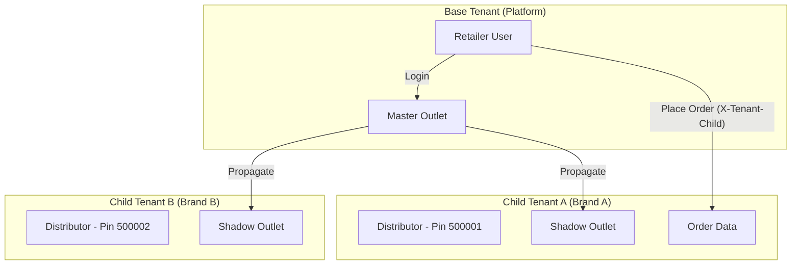
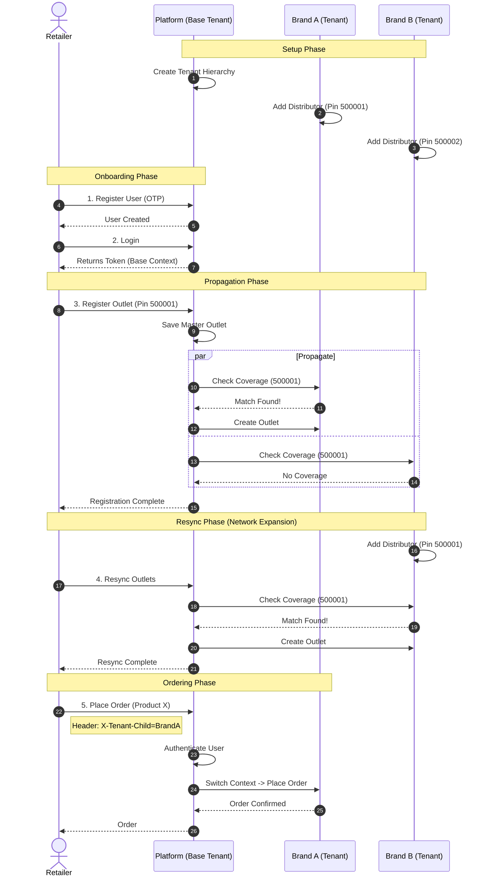

# Digivyapar Multi-Principle Onboarding & Ordering Workflow

This document provides a comprehensive guide to the **Digivyapar** multi-principle architecture, including detailed API references with sample requests and responses. This system enables a "Super App" experience where a centralized Platform (Base Tenant) manages user identities (Retailers), while multiple independent Brands (Child Tenants) manage their own operations, inventory, and supply chains.

## 1. Architectural Overview

**Base Tenant (Platform)**: Holds the Single Verification of Truth (SVOT) for Retailers. Managed by the Platform Owner.
**Child Tenant (Principle)**: Holds Catalog, Pricing, Inventory, and Distributor Networks. Managed by individual Brands.



---

## 2. API Reference

### Step 1: Tenant Hierarchy Setup

**Endpoint**: `POST /api/tenants/child`
**Authorization**: Bearer `<AdminToken>`

Creates a trust relationship between Platform and Brand.

#### Request
```json
{
  "childTenantId": "brand_a",
  "childTenantName": "Brand A - Foods",
  "adminUsername": "admin_brand_a",
  "adminPassword": "SecurePassword123!",
  "firstName": "Admin",
  "lastName": "BrandA"
}
```

#### Response (201 Created)
```json
{
  "tenantId": "brand_a",
  "name": "Brand A - Foods",
  "adminUser": "admin_brand_a"
}
```

---

### Step 2: Distributor Network Definition

**Endpoint**: `POST /distributors`
**Authorization**: Bearer `<ChildAdminToken>`
**Header**: `X-Tenant-Id: brand_a`

Defines where the brand can sell (Serviceability).

#### Request
```json
{
  "code": "DIST_DELHI_01",
  "name": "Delhi Distributors Pvt Ltd",
  "pincode": "110001",
  "active": true
}
```

#### Response (201 Created)
```json
{
  "id": 101,
  "code": "DIST_DELHI_01",
  "name": "Delhi Distributors Pvt Ltd",
  "pincode": "110001",
  "active": true
}
```

---

### Step 3: Retailer Onboarding (OTP Flow)

#### 3.1 Generate OTP
**Endpoint**: `POST /otp/generate`

#### Request
```json
{
  "phoneNumber": "+919876543210",
  "countryCode": "+91"
}
```

#### Response (200 OK)
```json
{
  "token": "tmp_token_xyz123",
  "otp": "123456" 
}
```
*(Note: OTP is returned in response only in dev mode; in prod, it is sent via SMS)*

#### 3.2 Confirm OTP
**Endpoint**: `POST /otp/confirm`

#### Request
```json
{
  "token": "tmp_token_xyz123",
  "otp": "123456"
}
```

#### Response (200 OK)
```json
{
  "token": "verified_token_abc789",
  "verified": true
}
```

#### 3.3 Register User
**Endpoint**: `POST /auth/user-register`

Creates the verified identity in the **Base Tenant**.

#### Request
```json
{
  "tenantId": "base_platform",
  "firstName": "Rahul",
  "lastName": "Gupta",
  "username": "rahul_store",
  "password": "MySecretPassword",
  "phone": "+919876543210",
  "otpEnabled": true,
  "otpToken": "verified_token_abc789",
  "orgType": "RETAILER"
}
```

#### Response (201 Created)
```json
{
  "id": 5001,
  "username": "rahul_store",
  "tenantId": "base_platform",
  "orgType": "RETAILER"
}
```

---

### Step 4: Outlet Registration & Propagation

**Endpoint**: `POST /outlets/register?propagate=true`
**Authorization**: Bearer `<RetailerToken>`

The Retailer registers their shop. The system automatically creates "Shadow Outlets" in connected Brands based on Pincode match.

#### Request
```json
{
  "name": "Gupta General Store",
  "pincode": "110001",
  "address": "123 Main Market, Connaught Place",
  "contactPerson": "Rahul Gupta",
  "phone": "+919876543210"
}
```

#### Response (200 OK)
```json
{
  "createdCount": 2,
  "outlets": [
    {
      "code": "OUT_110001_A1B2",
      "name": "Gupta General Store",
      "pincode": "110001",
      "tenantId": "base_platform"
    },
    {
      "code": "OUT_110001_A1B2",
      "name": "Gupta General Store",
      "pincode": "110001",
      "tenantId": "brand_a" 
    }
  ]
}
```
*(Note: Outlet created in `brand_a` because it services Pincode `110001`. Skip `brand_b` if it does not service this pincode.)*

---

### Step 5: Resync Capability

**Endpoint**: `POST /outlets/resync`
**Authorization**: Bearer `<RetailerToken>`

Used when a new Brand enters the region later. Retries propagation for existing outlets.

#### Request
*(Empty Body)*

#### Response (200 OK)
```json
{
  "createdCount": 1,
  "outlets": [
    {
      "code": "OUT_110001_A1B2",
      "name": "Gupta General Store",
      "tenantId": "brand_c" 
    }
  ],
  "message": "Resync completed successfully"
}
```

---

### Step 6: Cross-Tenant Order Placement

**Endpoint**: `POST /orders`
**Authorization**: Bearer `<RetailerToken>`
**Header**: `X-Tenant-Id: base_platform`
**Header**: `X-Tenant-Child: brand_a`

The Retailer (Base User) places an order that is saved in Brand A's system.

#### Request
```json
{
  "outletCode": "OUT_110001_A1B2",
  "distributor": "DIST_DELHI_01",
  "lines": [
    {
      "sku": "SKU_MSG_NOODLES",
      "qtyPieces": 24
    },
    {
      "sku": "SKU_KETCHUP_500G",
      "qtyPieces": 10
    }
  ]
}
```

#### Response (201 Created)
```json
{
  "order": {
    "orderNumber": "ORD-20240127-1005",
    "outletCode": "OUT_110001_A1B2",
    "distributor": "DIST_DELHI_01",
    "netAmount": 1540.00,
    "lines": [
       { "sku": "SKU_MSG_NOODLES", "lineAmount": 480.00 },
       { "sku": "SKU_KETCHUP_500G", "lineAmount": 1060.00 }
    ],
    "tenantId": "brand_a"
  }
}
```

---

## 3. Sequence Diagram


