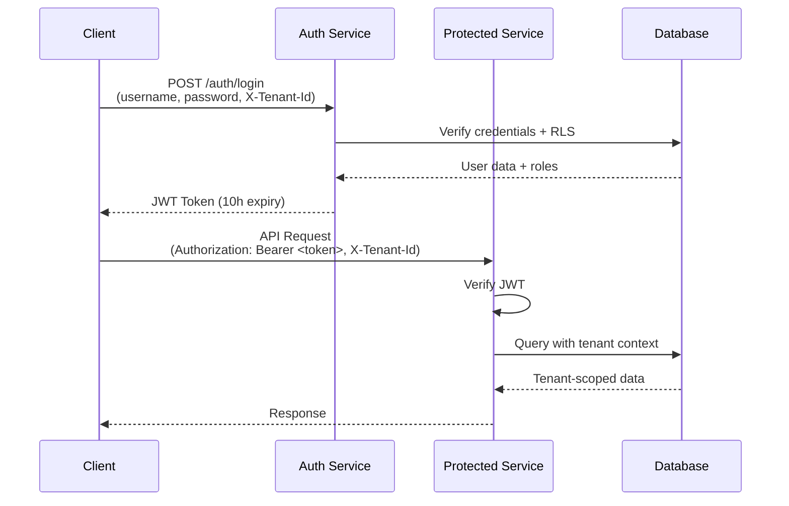

# 🚀 Salescodeai Saleshub API Documentation

> **Version:** 1.1  
> **Last Updated:** 2025-11-21

---

## 📋 Table of Contents

- [Overview](#-overview)
- [Getting Started](#-getting-started)
- [Authentication](#-authentication)
- [API Services](#-api-services)
  - [Auth Service](#-auth-service)
  - [Activity Service](#-activity-service)
  - [Catalog Service](#-catalog-service)
  - [Settings Service](#-settings-service) (formerly Config Service)
  - [KPI Service](#-kpi-service)
  - [Order Service](#-order-service)
  - [Outlet Service](#-outlet-service)
  - [Promotions Service](#-promotions-service)
  - [Target Group Service](#-target-group-service)
  - [Order Promo Audit Service](#-order-promo-audit-service)
  - [Recommendation Service](#-recommendation-service)
  - [Simulator Service](#-simulator-service)
  - [Task Service](#-task-service)
  - [Upload Service](#-upload-service)
  - [OAuth Service](#-oauth-service)
  - [Tax Service](#-tax-service)
- [Common Patterns](#-common-patterns)
- [Error Handling](#-error-handling)
- [Best Practices](#-best-practices)

---

## 🎯 Overview

Salescodeai Saleshub is a **comprehensive multi-tenant sales management platform** built on a modern microservices architecture. The platform provides enterprise-grade tools for managing sales operations, including order processing, catalog management, KPI tracking, ML-driven recommendations, and gamification features.

### 🏗️ Architecture Principles

**Microservices Architecture**
- Scalable, distributed services architecture
- Independent service deployment and scaling
- High availability and fault tolerance
- Optimized for performance and reliability

**Multi-Tenancy**
- Enterprise-grade data isolation between tenants
- Secure tenant context management
- Each request scoped to a specific tenant via `X-Tenant-Id` header

**Security**
- JWT-based authentication
- Role-based access control (RBAC)
- CORS configuration for cross-origin requests
- Encrypted database connections

### 🔧 Technical Stack

| Component | Technology |
|-----------|------------|
| **Architecture** | Microservices |
| **API Style** | RESTful HTTP API |
| **Data Isolation** | Tenant-based Separation |
| **Authentication** | JWT (Standard) / OAuth 2.0 |
| **Security** | Role-Based Access Control |
| **Format** | JSON |


---

## 🚀 Getting Started

### Prerequisites

1. **Obtain Credentials**
   - Tenant ID (provided by your administrator)
   - Username and password

2. **API Base URL**
   - Format: `https://api.salescodeai.com/v1`
   - Each service may have a different API Gateway endpoint

### Quick Start Flow



### Authentication Flow

1. **Login** to obtain JWT token
2. **Include headers** in all subsequent requests:
   - `Authorization: Bearer <token>`
   - `X-Tenant-Id: <your-tenant-id>`
3. **Token expires** after 10 hours (36000 seconds)
4. **Re-authenticate** when token expires

### Integration Flow (External Apps)

1. **Register Client** to obtain Client ID/Secret
2. **Post to /oauth/token** using Client Credentials to get Access Token
3. **Include Bearer token** in all API requests

---

## 🔐 Authentication

### Overview

The Auth Service provides secure authentication using JWT tokens with bcrypt password hashing. All passwords are hashed using bcrypt with a cost factor optimized for security.

### Multi-Tenant Security

**Row-Level Security (RLS)**
- Every database query is scoped to the tenant specified in `X-Tenant-Id`
- PostgreSQL's `set_config('app.tenant_id', ...)` ensures data isolation
- Prevents cross-tenant data leakage

**JWT Claims**
```json
{
  "iss": "salescodeai-auth",
  "sub": "user@example.com",
  "iat": 1700000000,
  "exp": 1700036000,
  "tenant_id": "t_abc123",
  "user_id": 42,
  "username": "user@example.com",
  "roles": ["SALES_REP", "MEMBER"]
}
```

---

## 📚 API Services

### 🔑 Auth Service

**Service Name:** `salesdblite-auth-service`

Handles user authentication, tenant registration, and JWT token generation.

#### Endpoints

| Method | Endpoint | Description | Auth Required |
|--------|----------|-------------|---------------|
| `POST` | `/auth/login` | Authenticate user and receive JWT token | ❌ |
| `POST` | `/auth/register` | Register a new tenant with initial admin | ❌ |
| `POST` | `/auth/user-register` | Register an individual user (with optional OTP) | ❌ |
| `POST` | `/otp/generate` | Generate OTP code for a phone number | ❌ |
| `POST` | `/otp/confirm` | Confirm OTP and receive verified token | ❌ |
| `POST` | `/oauth/token` | Obtain OAuth2 token (client_credentials) | ❌ |
| `POST` | `/oauth/clients` | Register a new OAuth client app | ✅ |

---

### 🧾 Tax Service

**Service Name:** `salesdblite-tax-service`

Handles tax rule management and resolution.

[View Detailed Tax API Documentation](TAX_API.md)

| Method | Endpoint | Description | Auth Required |
|--------|----------|-------------|---------------|
| `GET` | `/tax-rules` | List all tax rules | ✅ |
| `POST` | `/tax-rules` | Create or update a tax rule | ✅ |
| `DELETE` | `/tax-rules/{id}` | Delete a tax rule | ✅ |
| `GET` | `/tax-rules/effective` | Get resolved tax for a SKU | ✅ |

---

#### POST /auth/login

Authenticates a user and returns a JWT token valid for 10 hours.

**Request Headers:**
```http
Content-Type: application/json
X-Tenant-Id: your-tenant-id
```

**Request Body:**
```json
{
  "username": "admin@example.com",
  "password": "yourSecurePassword"
}
```

**Success Response (200 OK):**
```json
{
  "tenantId": "t_abc123",
  "userId": 42,
  "username": "admin@example.com",
  "roles": ["TENANT_ADMIN", "MEMBER"],
  "token": "eyJhbGciOiJIUzI1NiIsInR5cCI6IkpXVCJ9...",
  "expiresAt": "2025-11-20T23:00:00.000Z"
}
```

**Error Responses:**

| Status | Scenario | Response |
|--------|----------|----------|
| `400` | Missing username/password | `{"error": "username required"}` |
| `403` | Invalid credentials or inactive user | `{"error": "Invalid username or password"}` |
| `503` | Database unavailable | `{"error": "Database unavailable"}` |

**Implementation Details:**
- Password verification using bcrypt.compare()
- Single optimized SQL query with LEFT JOIN for user + roles
- BIGINT user IDs safely converted to numbers (or strings if > 2^53)
- Returns 403 (not 401) for failed login attempts to prevent user enumeration
- User must have `is_active = true` to login

**Example:**
```bash
curl -X POST https://<api-gateway-url>/auth/login \
  -H "Content-Type: application/json" \
  -H "X-Tenant-Id: bepensa" \
  -d '{
    "username": "admin@applicate.in",
    "password": "123Salescode$"
  }'
```

---

#### POST /auth/register

Creates a new tenant and registers the first admin user. If no tenant ID is provided, a new one is auto-generated.

**Request Headers:**
```http
Content-Type: application/json
X-Tenant-Id: optional-tenant-id
```

**Request Body:**
```json
{
  "tenantId": "optional-custom-id",
  "tenantName": "Acme Corporation",
  "firstName": "John",
  "lastName": "Doe",
  "username": "john.doe@acme.com",
  "password": "SecurePass123!",
  "email": "john.doe@acme.com",
  "phone": "+1234567890"
}
```

**Field Descriptions:**

| Field | Required | Description |
|-------|----------|-------------|
| `tenantId` | ❌ | Custom tenant ID (auto-generated if omitted) |
| `tenantName` | ❌ | Display name for tenant |
| `firstName` | ✅ | Admin user's first name |
| `lastName` | ✅ | Admin user's last name |
| `username` | ✅ | Admin user's login username |
| `password` | ✅ | Plain text password (hashed by DB function) |
| `email` | ❌ | Admin user's email |
| `phone` | ❌ | Admin user's phone number |

**Success Response (200 OK):**
```json
{
  "tenantId": "t_a1b2c3d4e5f6",
  "userId": 1
}
```

**Implementation Details:**
- Calls PostgreSQL function `register_tenant_admin(...)` which handles:
  - Tenant creation
  - Admin user creation with bcrypt password hashing
  - Role assignment (TENANT_ADMIN)
  - Atomic transaction (all-or-nothing)
- Auto-generates tenant ID using `gen_random_uuid()` if not provided
- Format: `t_<12-char-hex>` (e.g., `t_a1b2c3d4e5f6`)

---

#### POST /auth/user-register

Registers a new user into an existing tenant. Supports optional or mandatory OTP verification based on tenant settings.

**Request Body:**
```json
{
  "tenantId": "pepsi",
  "firstName": "John",
  "lastName": "Doe",
  "username": "jdoe_retailer",
  "password": "SecurePassword123!",
  "email": "john.doe@example.com",
  "phone": "9876543210",
  "address": "123 Main St",
  "pincode": "400001",
  "lat": 18.5204,
  "lon": 73.8567,
  "otpEnabled": false,
  "otpToken": "uuid-verified-token"
}
```

**OTP Verification:**
- If `otpEnabled` is true, or the tenant setting `auth.registration_otp_enabled` is true, an `otpToken` is required.
- The `otpToken` must be obtained and verified via the `/otp` endpoints.

---

#### 🔢 OTP Endpoints

**POST /otp/generate**
Generates a 6-digit OTP and returns a session token.
- Headers: `X-Tenant-Id`
- Body: `{"phoneNumber": "+91...", "countryCode": "+91"}`
- Returns: `{"token": "...", "otp": "123456"}`

**POST /otp/confirm**
Verifies the OTP code.
- Headers: `X-Tenant-Id`
- Body: `{"token": "...", "otp": "123456"}`
- Returns: `{"message": "OTP verified successfully"}` (Token is now verified)

---

### 🛡️ OAuth Service

**Service Name:** `salesdblite-oauth-service`

Supports external application integration using the standard OAuth 2.0 Client Credentials flow.

#### Endpoints

| Method | Endpoint | Description | Auth Required |
|--------|----------|-------------|---------------|
| `POST` | `/oauth/token` | Exchange client credentials for access token | ❌ |
| `POST` | `/oauth/clients` | Create a new OAuth client | ✅ (Admin) |
| `GET` | `/oauth/clients` | List registered OAuth clients | ✅ (Admin) |
| `DELETE` | `/oauth/clients/{id}` | Revoke an OAuth client | ✅ (Admin) |

For detailed implementation details, request/response formats, and security best practices, see the [OAuth API Documentation](./OAUTH_API.md).

---

### 📊 Activity Service

**Service Name:** `salesdblite-activity-service`

Tracks user activities and events for audit trails and analytics.

#### Endpoints

| Method | Endpoint | Description | Auth Required |
|--------|----------|-------------|---------------|
| `POST` | `/activity` | Create a new activity record | ✅ |
| `GET` | `/activity/recent` | Retrieve recent activities | ✅ |

**Use Cases:**
- Audit logging (who did what, when)
- User behavior analytics
- Activity feed for dashboards
- Compliance and security monitoring

**Configuration:**
- HTTP API access logging enabled for debugging
- 10-second timeout
- 512MB memory allocation

---

### 📦 Catalog Service

**Service Name:** `salesdblite-catalog-service`

Manages product catalogs with pricing, entitlements, and metadata.

#### Endpoints

| Method | Endpoint | Description | Auth Required |
|--------|----------|-------------|---------------|
| `GET` | `/catalog` | Retrieve product catalog with pricing | ✅ |
| `GET` | `/catalog/meta` | Get catalog metadata (brands, categories) | ✅ |
| `GET` | `/products` | List and filter product master data | ✅ |
| `GET` | `/products/search` | Bulk search products (OR-based) | ✅ |
| `GET` | `/catalog/*` | Unified catalog resolver (Pricing, Tags, Hierarchy) | ✅ |

For detailed documentation on the unified catalog resolver, see [Catalog API Documentation](./CATALOG_API.md).
For detailed product master data management, see [Product API Documentation](./PRODUCT_API.md).

---

#### GET /catalog

Returns the product catalog for a specific outlet with personalized pricing and entitlements.

**Request Headers:**
```http
Authorization: Bearer <jwt-token>
X-Tenant-Id: <tenant-id>
```

**Query Parameters:**

| Parameter | Required | Description | Example |
|-----------|----------|-------------|---------|
| `outlet` | ✅ | Outlet code | `OUT123` |
| `distributor` | ❌ | Filter by distributor | `DIST_A` |
| `q` | ❌ | Search query (SKU, Name, Brand, Category, **Product Tags**) | `milk` |
| `hierarchical` | ❌ | Aggregate results from all child tenants (default: **true**) | `true` |
| `asOf` | ❌ | Price effective date (YYYY-MM-DD) | `2025-11-20` |
| `limit` | ❌ | Max results (default: 100) | `50` |
| `offset` | ❌ | Pagination offset (default: 0) | `0` |

**Success Response (200 OK):**
```json
[
  {
    "tenantId": "parent_tenant",
    "sku": "PROD-001",
    "name": "Amul Milk 1L",
    "brand": "Amul",
    "category": "Dairy",
    "imageUrl": "https://cdn.example.com/amul-milk.jpg",
    "uom": "UNIT",
    "unitsPerCase": 12,
    "mrp": 60.00,
    "distributorCode": "DIST_A",
    "entitlementActive": true,
    "moqUnits": 6,
    "leadTimeDays": 2,
    "priceRuleId": 42,
    "priceScopeUsed": "OUTLET_PRODUCT",
    "priceUnit": 55.00,
    "priceCase": 650.00,
    "pricePiece": 4.58,
    "priceStartOn": "2025-11-01",
    "priceEndOn": "2025-11-30",
    "productActive": true
  }
]
```

**Field Descriptions:**

| Field | Type | Description |
|-------|------|-------------|
| `tenantId` | string | ID of the tenant owning this product |
| `sku` | string | Unique product identifier |
| `name` | string | Product display name |
| `brand` | string | Brand name |
| `category` | string | Product category |
| `imageUrl` | string\|null | Product image URL |
| `uom` | string | Unit of measure (UNIT, CASE, PIECE) |
| `unitsPerCase` | number\|null | Number of units per case |
| `mrp` | number\|null | Maximum Retail Price |
| `distributorCode` | string\|null | Distributor code |
| `entitlementActive` | boolean | Whether outlet is entitled to this product |
| `moqUnits` | number\|null | Minimum Order Quantity in units |
| `leadTimeDays` | number\|null | Delivery lead time in days |
| `priceRuleId` | number\|null | ID of applied pricing rule |
| `priceScopeUsed` | string\|null | Pricing scope (OUTLET_PRODUCT, DISTRIBUTOR, etc.) |
| `priceUnit` | number\|null | Price per unit |
| `priceCase` | number\|null | Price per case |
| `pricePiece` | number\|null | Price per piece |
| `priceStartOn` | string\|null | Price validity start date |
| `priceEndOn` | string\|null | Price validity end date |
| `productActive` | boolean | Whether product is active |

**Implementation Details:**
- Calls PostgreSQL function `get_catalog(outlet_code, salesrep_username)`
- Function applies complex business logic:
  - Entitlement checking (outlet-product permissions)
  - Price rule resolution (hierarchical: outlet-product → distributor → default)
  - Active product filtering
  - Distributor assignment
- JWT token decoded to extract `salesrep_username`
- Results are tenant-scoped via RLS

**Example: Multi-Tenant Tag Search**
```bash
# This searches for products tagged with "premium" across the parent and all child tenants
curl -G "https://<api-gateway-url>/catalog" \
  --data-urlencode "q=premium" \
  -H "Authorization: Bearer <jwt-token>" \
  -H "X-Tenant-Id: <parent-tenant-id>"
```

---

#### Catalog Meta API

Retrieves and manages catalog metadata such as brands, categories, subcategories, and mother codes.

For detailed documentation, see [Catalog Meta API Documentation](./CATALOG_META_API.md).

---

---

### ⚙️ Settings Service

**Service Name:** `salesdblite-settings-service` (formerly Config Service)

Centralized configuration and settings management for the application. This service provides a flexible key-value store for feature flags, business rules, and UI configuration.

For a detailed guide on available settings and how they impact system behavior, see the [System Settings Guide](./SYSTEM_SETTINGS_GUIDE.md).

#### Endpoints

| Method | Endpoint | Description | Auth Required |
|--------|----------|-------------|---------------|
| `GET` | `/api/settings` | List all settings (masked by default) | ✅ |
| `GET` | `/api/settings/{feature}/{key}` | Get a specific setting | ✅ |
| `PUT` | `/api/settings` | Create or update a setting | ✅ |
| `PUT` | `/api/settings/bulk` | Bulk upsert settings | ✅ |
| `GET` | `/api/settings/features` | List all unique features | ✅ |
| `DELETE` | `/api/settings/{feature}/{key}` | Delete a setting | ✅ |

---

#### GET /api/settings

Retrieves tenant-specific configuration settings.

**Request Headers:**
```http
Authorization: Bearer <jwt-token>
X-Tenant-Id: <tenant-id>
```

**Query Parameters:**

| Parameter | Required | Description | Example |
|-----------|----------|-------------|---------|
| `feature` | ❌ | Feature name to filter settings | `auth`, `catalog`, `ui` |
| `q` | ❌ | Search query (matches key, feature, or description) | `radius` |
| `include_secrets` | ❌ | Include sensitive configuration (requires admin role) | `true`, `false` |
| `limit` | ❌ | Max results (default: 100) | `50` |
| `offset` | ❌ | Pagination offset (default: 0) | `10` |

**Success Response (200 OK):**
```json
{
  "items": [
    {
      "id": 1,
      "feature": "catalog",
      "key": "distributor_search_radius_km",
      "valueType": "NUMBER",
      "valueJson": 5.0,
      "isSecret": false,
      "description": "Search radius for distributors"
    }
  ]
}
```

**Common System Settings:**
- `auth`: `registration_otp_enabled` (BOOLEAN)
- `catalog`: `distributor_search_radius_km` (NUMBER)

**Security Note:**
- Sensitive settings marked as `isSecret` are masked with `"***"` unless `include_secrets=true` is used.
- Only users with `TENANT_ADMIN` or equivalent roles can view unmasked secrets.

**Example:**
```bash
curl -G "https://<api-base-url>/api/settings" \
  --data-urlencode "feature=catalog" \
  --data-urlencode "include_secrets=true" \
  -H "Authorization: Bearer <jwt-token>" \
  -H "X-Tenant-Id: <tenant-id>"
```

---

### 📈 KPI Service

**Service Name:** `salesdblite-kpi-service`

Key Performance Indicators and analytics for sales representatives.

#### Endpoints

| Method | Endpoint | Description | Auth Required |
|--------|----------|-------------|---------------|
| `GET` | `/kpi/salesrep/daily` | Get daily sales rep KPIs (query params) | ✅ |
| `POST` | `/kpi/salesrep/daily` | Get daily sales rep KPIs (JSON body) | ✅ |

---

#### GET/POST /kpi/salesrep/daily

Retrieves daily KPIs for a sales representative. Both GET and POST methods are supported for flexibility.

**Request Headers:**
```http
Authorization: Bearer <jwt-token>
X-Tenant-Id: <tenant-id>
```

**Query Parameters (GET) / Request Body (POST):**

| Parameter | Required | Description | Example |
|-----------|----------|-------------|---------|
| `salesrep` | ❌ | Sales rep username (defaults to logged-in user) | `john.doe@acme.com` |
| `date` | ❌ | Date for KPIs (YYYY-MM-DD, defaults to today) | `2025-11-20` |
| `from` | ❌ | Start date for range | `2025-11-01` |
| `to` | ❌ | End date for range | `2025-11-30` |

**Success Response (200 OK):**
```json
{
  "salesrep": "john.doe@acme.com",
  "date": "2025-11-20",
  "metrics": {
    "ordersPlaced": 15,
    "outletsVisited": 12,
    "totalRevenue": 125000.50,
    "averageOrderValue": 8333.37,
    "targetAchievement": 85.5,
    "activitiesLogged": 28
  },
  "trends": {
    "revenueVsYesterday": 12.5,
    "ordersVsYesterday": -2
  }
}
```

**Use Cases:**
- Daily performance dashboards
- Sales rep leaderboards
- Target tracking and achievement
- Performance analytics

**Why Both GET and POST?**
- **GET**: Simple queries with few parameters
- **POST**: Complex queries with many filters (avoids URL length limits)

**Example (GET):**
```bash
curl -G "https://<api-gateway-url>/kpi/salesrep/daily" \
  --data-urlencode "date=2025-11-20" \
  -H "Authorization: Bearer <jwt-token>" \
  -H "X-Tenant-Id: <tenant-id>"
```

**Example (POST):**
```bash
curl -X POST "https://<api-gateway-url>/kpi/salesrep/daily" \
  -H "Content-Type: application/json" \
  -H "Authorization: Bearer <jwt-token>" \
  -H "X-Tenant-Id: <tenant-id>" \
  -d '{
    "salesrep": "john.doe@acme.com",
    "from": "2025-11-01",
    "to": "2025-11-30"
  }'
```

---

### 🛒 Order Service

**Service Name:** `salesdblite-order-service`

Comprehensive order creation, retrieval, and management.

#### Endpoints

| Method | Endpoint | Description | Auth Required |
|--------|----------|-------------|---------------|
| `POST` | `/orders` | Create a new order (with `dryRun` option) | ✅ |
| `GET` | `/orders` | List all orders for logged-in user | ✅ |
| `GET` | `/orders/summary` | Get high-level metrics (total, pending, approved) | ✅ |
| `GET` | `/orders/{id}` | Get specific order by ID (with `expand` option) | ✅ |
| `PUT` | `/orders/{id}` | Update top-level order metadata | ✅ |
| `POST` | `/orders/{id}/status` | Change order status (e.g., Submit, Approve) | ✅ |
| `POST` | `/orders/{id}/lines` | Add a new line item to an order | ✅ |
| `PUT` | `/orders/{id}/lines/{lineId}` | Update an existing line item | ✅ |
| `DELETE` | `/orders/{id}/lines/{lineId}` | Remove a line item from an order | ✅ |

**Configuration:**
- Debug logging enabled (`DEBUG=true`)
- 10-second timeout
- 512MB memory

---

#### POST /orders

Creates a new order with line items. Automatically calculates totals and validates data.

**Query Parameters:**
| Parameter | Type | Required | Description |
|-----------|------|----------|-------------|
| `dryRun` | boolean | ❌ | If true, simulates order without saving (returns calculated prices/promos) |

**Request Headers:**
```http
Content-Type: application/json
Authorization: Bearer <jwt-token>
X-Tenant-Id: <tenant-id>
```

**Request Body:**
```json
{
  "outletCode": "OUT123",
  "distributor": "DIST_A",
  "orderNumber": "ORD-2025-001",
  "referenceNumber": "REF-ABC-123",
  "notes": "Urgent delivery required",
  "lines": [
    {
      "sku": "PROD-001",
      "distributor": "DIST_A",
      "uom": "UNIT",
      "qtyCases": 2,
      "qtyPieces": 5,
      "unitPrice": 55.00,
      "lineUnits": 29,
      "lineAmount": 1595.00,
      "discount": 50.00,
      "isFree": false,
      "priceRuleId": 42,
      "priceUomUsed": "UNIT",
      "shape": "COMPANY",
      "extendedAttr": {
        "promotion": "WINTER_SALE"
      }
    }
  ]
}
```

**Field Descriptions:**

| Field | Required | Description |
|-------|----------|-------------|
| `outletCode` | ✅ | Outlet identifier |
| `distributor` | ❌ | Default distributor for all lines |
| `orderNumber` | ❌ | Custom order number (auto-generated if omitted) |
| `referenceNumber` | ❌ | Unique external reference to avoid duplications |
| `notes` | ❌ | Order notes |
| `lines` | ✅ | Array of order line items |
| `lines[].sku` | ✅ | Product SKU |
| `lines[].distributor` | ❌ | Line-specific distributor (overrides header) |
| `lines[].uom` | ❌ | Unit of measure (default: UNIT) |
| `lines[].qtyCases` | ❌ | Quantity in cases |
| `lines[].qtyPieces` | ❌ | Quantity in pieces |
| `lines[].unitPrice` | ❌ | Price per unit |
| `lines[].lineUnits` | ❌ | Total units (cases × unitsPerCase + pieces) |
| `lines[].lineAmount` | ❌ | Line total (calculated if omitted) |
| `lines[].discount` | ❌ | Line discount amount |
| `lines[].isFree` | ❌ | Free goods flag |
| `lines[].priceRuleId` | ❌ | Applied price rule ID |
| `lines[].priceUomUsed` | ❌ | UOM used for pricing |
| `lines[].shape` | ❌ | Order shape (COMPANY, DISTRIBUTOR) |
| `lines[].extendedAttr` | ❌ | Custom attributes (JSON) |

**Success Response (201 Created):**
```json
{
  "id": "12345",
  "orderNumber": "ORD-2025-001",
  "referenceNumber": "REF-ABC-123",
  "outlet": "OUT123",
  "salesrep": "john.doe@acme.com",
  "distributor": "DIST_A",
  "statusCode": 1,
  "orderedAt": "2025-11-20T12:00:00.000Z",
  "notes": "Urgent delivery required",
  "extendedAttr": {},
  "grossAmount": 1595.00,
  "discount": 50.00,
  "netAmount": 1545.00,
  "lineCount": 1,
  "lines": [
    {
      "id": "67890",
      "orderId": "12345",
      "sku": "PROD-001",
      "distributor": "DIST_A",
      "uom": "UNIT",
      "qtyCases": 2,
      "qtyPieces": 5,
      "unitPrice": 55.00,
      "lineUnits": 29,
      "lineAmount": 1595.00,
      "discount": 50.00,
      "isFree": false,
      "priceRuleId": 42,
      "priceUomUsed": "UNIT",
      "shape": "COMPANY",
      "extendedAttr": {
        "promotion": "WINTER_SALE"
      }
    }
  ]
}
```

**Implementation Details:**

1. **Dual Calculation Strategy:**
   - Client sends preliminary totals
   - Server recalculates authoritative totals from database
   - Prevents tampering and ensures accuracy

2. **Transaction Flow:**
   ```
   BEGIN TRANSACTION
   ├─ Set tenant context
   ├─ Insert order header (with client totals)
   ├─ Insert order lines
   ├─ Recalculate totals from DB (authoritative)
   ├─ Update order header with DB totals
   └─ COMMIT
   ```

3. **Auto-generated Order Number:**
   - Format: `ORD-<timestamp>` (e.g., `ORD-1700000000000`)
   - Unique per order

4. **Salesrep Extraction:**
   - Extracted from JWT token (`username` or `sub` claim)
   - Ensures orders are attributed to the authenticated user

**Example:**
```bash
curl -X POST "https://<api-gateway-url>/orders" \
  -H "Content-Type: application/json" \
  -H "Authorization: Bearer <jwt-token>" \
  -H "X-Tenant-Id: <tenant-id>" \
  -d '{
    "outletCode": "OUT123",
    "distributor": "DIST_A",
    "lines": [
      {
        "sku": "PROD-001",
        "qtyCases": 2,
        "unitPrice": 55.00,
        "lineUnits": 24,
        "lineAmount": 1320.00
      }
    ]
  }'
```

---

#### GET /orders

Lists orders for the authenticated sales representative with optional filtering.

**Request Headers:**
```http
Authorization: Bearer <jwt-token>
X-Tenant-Id: <tenant-id>
```

**Query Parameters:**

| Parameter | Required | Description | Example |
|-----------|----------|-------------|---------|
| `status` | ❌ | Filter by status code | `1` (pending), `2` (approved) |
| `from` | ❌ | Start date (ISO 8601) | `2025-11-01T00:00:00Z` |
| `to` | ❌ | End date (ISO 8601) | `2025-11-30T23:59:59Z` |
| `limit` | ❌ | Max results (default: 50) | `100` |
| `offset` | ❌ | Pagination offset (default: 0) | `50` |
| `withLines` | ❌ | Include line items (default: false) | `true` |

**Success Response (200 OK):**
```json
[
  {
    "id": "12345",
    "orderNumber": "ORD-2025-001",
    "outlet": "OUT123",
    "salesrep": "john.doe@acme.com",
    "distributor": "DIST_A",
    "statusCode": 1,
    "orderedAt": "2025-11-20T12:00:00.000Z",
    "notes": "Urgent delivery",
    "extendedAttr": {},
    "grossAmount": 1595.00,
    "discount": 50.00,
    "netAmount": 1545.00,
    "lineCount": 1,
    "lines": [...]
  }
]
```

**Performance Optimization:**
- `withLines=false`: Returns only order headers (fast)
- `withLines=true`: Bulk fetches all lines in a single query (efficient)

**Example:**
```bash
# Get recent orders with line items
curl -G "https://<api-gateway-url>/orders" \
  --data-urlencode "from=2025-11-01T00:00:00Z" \
  --data-urlencode "to=2025-11-30T23:59:59Z" \
  --data-urlencode "withLines=true" \
  --data-urlencode "limit=50" \
  -H "Authorization: Bearer <jwt-token>" \
  -H "X-Tenant-Id: <tenant-id>"
```

---

#### GET /orders/{id}

Retrieves a specific order by ID with all line items.

**Request Headers:**
```http
Authorization: Bearer <jwt-token>
X-Tenant-Id: <tenant-id>
```

**Path Parameters:**

| Parameter | Description | Example |
|-----------|-------------|---------|
| `id` | Order ID | `12345` |

**Query Parameters:**
| Parameter | Type | Required | Description |
|-----------|------|----------|-------------|
| `expand` | string | ❌ | Include `lines` to get order line items. |

**Success Response (200 OK):**
```json
{
  "id": "12345",
  "orderNumber": "ORD-2025-001",
  "outlet": "OUT123",
  "salesrep": "john.doe@acme.com",
  "distributor": "DIST_A",
  "statusCode": 1,
  "orderedAt": "2025-11-20T12:00:00.000Z",
  "notes": "Urgent delivery",
  "extendedAttr": {},
  "grossAmount": 1595.00,
  "discount": 50.00,
  "netAmount": 1545.00,
  "lineCount": 1,
  "lines": [...]
}
```

**Error Responses:**

| Status | Scenario | Response |
|--------|----------|----------|
| `400` | Invalid order ID | `{"error": "Invalid order id"}` |
| `404` | Order not found or not owned by user | `{"error": "Not found"}` |

**Security:**
- Only returns orders where `salesrep_username` matches the authenticated user
- Prevents unauthorized access to other users' orders

**Example:**
```bash
curl "https://<api-gateway-url>/orders/12345" \
  -H "Authorization: Bearer <jwt-token>" \
  -H "X-Tenant-Id: <tenant-id>"
```

---

#### GET /orders/summary

Retrieves high-level metrics for orders.

**Success Response (200 OK):**
```json
{
  "totalOrders": 150,
  "pendingOrders": 12,
  "approvedOrders": 45,
  "totalOrderValue": 1250000.50
}
```

---

#### PUT /orders/{id}

Updates top-level metadata for an order.

**Request Body:**
```json
{
  "distributorCode": "DIST_NEW",
  "notes": "Updated delivery note",
  "salesrep": "sr_username",
  "outletCode": "OUT_001"
}
```

---

#### POST /orders/{id}/status

Transitions the order to a new status.

**Request Body:**
```json
{
  "statusCode": 2,
  "reason": "Manager approved"
}
```

**Status Mapping:**
- `0`: DRAFT
- `1`: SUBMITTED
- `2`: APPROVED
- `3`: REJECTED
- `4`: CANCELLED
- `5`: FULFILLED

---

#### Line Item Management

**Add Line:** `POST /orders/{id}/lines`
**Update Line:** `PUT /orders/{id}/lines/{lineId}`

**Payload (OrderLineUpsertRequest):**
```json
{
  "sku": "PROD_001",
  "qtyCases": 5,
  "uom": "CASE",
  "distributor": "DIST_A"
}
```

**Delete Line:** `DELETE /orders/{id}/lines/{lineId}`

---

### 🏪 Outlet Service

**Service Name:** `salesdblite-outlet-service`

Manages retail outlets and locations.

#### Endpoints

| Method | Endpoint | Description | Auth Required |
|--------|----------|-------------|---------------|
| `GET` | `/outlets` | Retrieve all outlets | ✅ |
| `GET` | `/outlets/associations` | Retrieve outlet-salesrep-distributor tree | ✅ |
| `GET` | `/outlets/unique-values` | Retrieve unique outlet values from database | ✅ |
| `GET` | `/channels` | Retrieve distinct channels | ✅ |
| `GET` | `/retailer-maps` | List retailer-distributor-salesrep mappings | ✅ |
| `POST` | `/outlets/register` | Register new outlet with auto-association | ✅ |
| `POST` | `/retailer-maps/sync` | Full-sync mappings for specific outlets | ✅ |

---

#### POST /outlets/register

Registers a new outlet. It supports intelligent auto-association with distributors.

**Query Parameters:**
- `autoMapDistributor` (boolean, default=false): If true, attempts to link the outlet to a distributor.
  - **Match Logic:**
    1. **Pincode Match:** Priority is given to distributors sharing the same pincode.
    2. **Location Proximity:** Fallback to the nearest distributor based on lat/lon distance.

**Request Body:**
```json
{
  "code": "OUT_NEW_01",
  "name": "New Retail Store",
  "pincode": "110001",
  "lat": 28.6139,
  "lon": 77.2090
}
```

For detailed retailer mapping master data management, see [Retailer Map API Documentation](./RETAILER_MAP_API.md).

---

#### GET /outlets/associations

Returns a full tree of associations: **Outlet ➔ SalesRep ➔ Distributors**. This is used to resolve the organizational hierarchy for any user context.

**Query Parameters:**

| Parameter | Type | Required | Description |
|-----------|------|----------|-------------|
| `retailerUser` | `string` | No | Resolve associations for a specific user. |

**Success Response (200 OK):**
```json
[
  {
    "outlet": { "code": "OUT_001", "name": "Kiran Store", ... },
    "distributors": [
      { "code": "DIST_01", "name": "Main Distributor" }
    ],
    "salesreps": [
      {
        "salesrep": { "username": "SR_ALICE", ... },
        "distributors": [
          { "code": "DIST_01", "name": "Main Distributor" }
        ]
      }
    ]
  }
]
```

**Additional Sample (Direct Outlet-Distributor):**
Shows the response when only direct outlet-distributor associations are present (common for Retailer users).
```json
[
  {
    "outlet": { "code": "OUT_002", "name": "City Retail", ... },
    "distributors": [
      { "code": "DIST_01", "name": "Main Distributor" }
    ],
    "salesreps": []
  }
]
```

---

#### GET /outlets

Retrieves all outlets accessible to the authenticated user.

**Request Headers:**
```http
Authorization: Bearer <jwt-token>
X-Tenant-Id: <tenant-id>
```

**Query Parameters:**

| Parameter | Required | Description | Example |
|-----------|----------|-------------|---------|
| `distributor` | ❌ | Filter by distributor | `DIST_A` |
| `region` | ❌ | Filter by region | `NORTH` |
| `active` | ❌ | Filter by active status | `true` |
| `limit` | ❌ | Max results | `100` |
| `offset` | ❌ | Pagination offset | `0` |
| `q` | ❌ | General Search (code, name, channel, phone) | `9876543210` |
| `outletType` | ❌ | Filter by outlet type | `Retail` |
| `outletCategory` | ❌ | Filter by outlet category | `Premium` |
| `outletClass` | ❌ | Filter by outlet class | `Class A` |
| `city` | ❌ | Filter by city | `Mumbai` |
| `state` | ❌ | Filter by state | `Maharashtra` |

**Success Response (200 OK):**
```json
[
  {
    "code": "OUT123",
    "name": "Sharma General Store",
    "address": "123 Main St, Mumbai",
    "city": "Mumbai",
    "state": "Maharashtra",
    "pincode": "400001",
    "phone": "+91-9876543210",
    "distributorCode": "DIST_A",
    "region": "WEST",
    "latitude": 19.0760,
    "longitude": 72.8777,
    "isActive": true
  }
]
```

**Use Cases:**
- Sales rep route planning
- Outlet selection in order creation
- Territory management
- Geolocation-based features

---


### ⚡ Unification Service

**Service Name:** `salesdblite-unification-service`

Provides capabilities for users to discover and claim existing outlets in the system, preventing data duplication.

For detailed documentation, see [Unification API Documentation](./UNIFICATION_API.md).

---

#### GET /channels

Retrieves a list of distinct channel names from the outlet database, optionally filtered by sales rep or distributor association.

**Query Parameters:**

| Parameter | Required | Description | Example |
|-----------|----------|-------------|---------|
| `salesRep` | ❌ | Filter by Sales Rep username | `john.doe` |
| `distributor` | ❌ | Filter by Distributor code | `DIST_A` |

**Success Response (200 OK):**
```json
[
  "GT",
  "MT",
  "HORECA",
  "KA"
]
```

---

### 🎯 Recommendation Service

**Service Name:** `salesdblite-recommendation-service`

Provides ML-driven product recommendations for outlets including regular orders, upsells, cross-sells, and promotional items.

#### Endpoints

| Method | Endpoint | Description | Auth Required |
|--------|----------|-------------|---------------|
| `GET` | `/recommendations` | Retrieve product recommendations for an outlet | ✅ |

**Configuration:**
- **Timeout:** 10 seconds
- **Memory:** 512MB
- **Database:** Uses `recommendation_item` table with RLS

---

#### GET /recommendations

Retrieves ML-generated product recommendations for a specific outlet with optional filtering by date range and recommendation type.

**Request Headers:**
```http
Authorization: Bearer <jwt-token>
X-Tenant-Id: <tenant-id>
```

**Query Parameters:**

| Parameter | Required | Description | Example |
|-----------|----------|-------------|---------|
| `outlet` | ✅ | Outlet code | `OUT123` |
| `from` | ❌ | Start date for target_date filter (YYYY-MM-DD) | `2025-11-01` |
| `to` | ❌ | End date for target_date filter (YYYY-MM-DD) | `2025-11-30` |
| `types` | ❌ | Comma-separated recommendation types | `REGULAR,UPSELL` |

**Recommendation Types:**
- `REGULAR` - Standard replenishment recommendations
- `UPSELL` - Higher-value product suggestions
- `CROSS_SELL` - Complementary product suggestions
- `FOCUS_PRODUCT` - Strategic focus items
- `PROMOTION` - Promotional campaign items
- `OTHER` - Miscellaneous recommendations

**Success Response (200 OK):**
```json
[
  {
    "id": "12345",
    "tenantId": "bepensa",
    "loginId": "salesrep@example.com",
    "outletCode": "OUT123",
    "sku": "PROD-001",
    "recType": "REGULAR",
    "targetDate": "2025-11-27",
    "recommendedQty": 24,
    "score": 0.85,
    "meta": {
      "confidence": "high",
      "reason": "historical_pattern",
      "avgWeeklyDemand": 6,
      "lastOrderDate": "2025-11-13",
      "stockoutRisk": "low"
    },
    "createdAt": "2025-11-20T10:00:00.000Z",
    "createdBy": "ml-engine",
    "updatedAt": "2025-11-20T10:00:00.000Z",
    "updatedBy": "ml-engine"
  }
]
```

**Field Descriptions:**

| Field | Type | Description |
|-------|------|-------------|
| `id` | string | Unique recommendation identifier |
| `tenantId` | string | Tenant identifier |
| `loginId` | string | Sales rep login ID |
| `outletCode` | string | Target outlet code |
| `sku` | string | Product SKU |
| `recType` | string | Recommendation type (enum) |
| `targetDate` | string | Date for which recommendation is valid |
| `recommendedQty` | number | Suggested order quantity |
| `score` | number | Confidence score (0.0 to 1.0) |
| `meta` | object | Additional ML metadata (JSONB) |
| `createdAt` | string | Timestamp when recommendation was created |
| `createdBy` | string | Creator (usually 'ml-engine') |
| `updatedAt` | string | Last update timestamp |
| `updatedBy` | string | Last updater |

**Implementation Details:**
- Queries `recommendation_item` table with tenant-scoped RLS
- Supports dynamic filtering by date range and recommendation types
- Results ordered by: `target_date ASC`, `rec_type ASC`, `sku ASC`
- JWT token validated for authentication
- All queries scoped to tenant context via `set_config('app.tenant_id', ...)`

**Use Cases:**
- **Smart Order Suggestions:** Pre-populate order forms with ML recommendations
- **Inventory Optimization:** Prevent stockouts with predictive recommendations
- **Upselling:** Suggest higher-value alternatives to increase order value
- **Cross-selling:** Recommend complementary products
- **Campaign Management:** Push promotional items to specific outlets
- **Sales Rep Efficiency:** Reduce time spent on order planning

**Example Requests:**

Basic request (all recommendations for an outlet):
```bash
curl -G "https://<api-gateway-url>/recommendations" \
  --data-urlencode "outlet=OUT123" \
  -H "Authorization: Bearer <jwt-token>" \
  -H "X-Tenant-Id: bepensa"
```

With date range:
```bash
curl -G "https://<api-gateway-url>/recommendations" \
  --data-urlencode "outlet=OUT123" \
  --data-urlencode "from=2025-11-01" \
  --data-urlencode "to=2025-11-30" \
  -H "Authorization: Bearer <jwt-token>" \
  -H "X-Tenant-Id: bepensa"
```

Filter by recommendation types:
```bash
curl -G "https://<api-gateway-url>/recommendations" \
  --data-urlencode "outlet=OUT123" \
  --data-urlencode "types=REGULAR,UPSELL" \
  -H "Authorization: Bearer <jwt-token>" \
  -H "X-Tenant-Id: bepensa"
```

**Error Responses:**

| Status | Scenario | Response |
|--------|----------|----------|
| `400` | Missing outlet parameter | `{"error": "outlet parameter is required"}` |
| `401` | Missing/invalid JWT token | `{"error": "Authorization token missing"}` or `{"error": "Invalid token"}` |
| `403` | RLS policy violation | `{"error": "Access denied by RLS/policy"}` |
| `500` | Database error | `{"error": "Internal DB error"}` |
| `503` | Database unavailable | `{"error": "Database unavailable"}` |

**Performance Considerations:**
- Indexes on `(tenant_id, outlet_code)`, `(tenant_id, rec_type)`, and `target_date`
- Typical response time: 50-200ms for 100 recommendations
- Recommendation data typically refreshed daily by ML pipeline
- Consider caching recommendations client-side for 1-4 hours

---

### 🤖 Simulator Service

**Service Name:** `salesdblite-simulator-service`

AI-powered web scraping and search simulation using Puppeteer and OpenAI.

#### Endpoints

| Method | Endpoint | Description | Auth Required |
|--------|----------|-------------|---------------|
| `POST` | `/scrape/search` | Perform AI-powered web search and scraping | ✅ |

**Configuration:**
- **Timeout:** 30 seconds (extended for scraping)
- **Memory:** 512MB
- **Dependencies:** Puppeteer, Chromium, OpenAI GPT
- **Environment:**
  - `OPENAI_API_KEY`: Required
  - `OPENAI_TIMEOUT_MS`: 15000ms
  - `TIME_BUDGET_MS`: 20000ms

---

#### POST /scrape/search

Performs intelligent web scraping using headless Chrome and AI-powered content extraction.

**Request Headers:**
```http
Content-Type: application/json
Authorization: Bearer <jwt-token>
X-Tenant-Id: <tenant-id>
```

**Request Body:**
```json
{
  "query": "latest smartphone prices in India",
  "maxResults": 10,
  "extractionPrompt": "Extract product names, prices, and specifications"
}
```

**Success Response (200 OK):**
```json
{
  "query": "latest smartphone prices in India",
  "results": [
    {
      "title": "iPhone 15 Pro",
      "price": "₹1,34,900",
      "url": "https://example.com/iphone-15-pro",
      "extractedData": {
        "specifications": "6.1-inch display, A17 Pro chip, 48MP camera"
      }
    }
  ],
  "scrapedAt": "2025-11-20T12:00:00.000Z"
}
```

**Use Cases:**
- Competitive price monitoring
- Market research automation
- Product availability checking
- Lead generation

**Technical Implementation:**
- Uses a headless browser for web navigation
- Stealth mode to avoid bot detection
- AI models for intelligent content extraction
- Respects time budgets to prevent service timeouts

**⚠️ Important Notes:**
- Ensure compliance with target website's robots.txt and terms of service
- Rate limiting recommended to avoid IP bans
- Extended timeout (30s) to accommodate scraping operations

---

### 🎮 Task Service (Gamification)

**Service Name:** `salesdblite-task-service`

Gamification and progress tracking for sales representatives.

#### Endpoints

| Method | Endpoint | Description | Auth Required |
|--------|----------|-------------|---------------|
| `GET` | `/gamification/progress` | Get user gamification progress | ✅ |
| `POST` | `/gamification/progress` | Update gamification progress | ✅ |

---

#### GET /gamification/progress

Retrieves gamification metrics for the authenticated user.

**Request Headers:**
```http
Authorization: Bearer <jwt-token>
X-Tenant-Id: <tenant-id>
```

**Success Response (200 OK):**
```json
{
  "userId": 42,
  "username": "john.doe@acme.com",
  "level": 5,
  "experiencePoints": 2500,
  "nextLevelAt": 3000,
  "badges": [
    {
      "id": "first_order",
      "name": "First Order",
      "description": "Placed your first order",
      "earnedAt": "2025-11-01T10:00:00.000Z"
    }
  ],
  "achievements": {
    "ordersThisMonth": 45,
    "targetAchievement": 90.0,
    "streak": 7
  }
}
```

---

#### POST /gamification/progress

Updates gamification progress (e.g., award badge, add XP).

**Request Headers:**
```http
Content-Type: application/json
Authorization: Bearer <jwt-token>
X-Tenant-Id: <tenant-id>
```

**Request Body:**
```json
{
  "action": "AWARD_BADGE",
  "badgeId": "top_performer",
  "experiencePoints": 100
}
```

**Use Cases:**
- Sales rep motivation
- Performance tracking
- Leaderboards
- Achievement systems

---

### 🏷️ Promotions Service

**Service Name:** `salesdblite-promotions-service`

Comprehensive promotion engine for managing and evaluating sales schemes, discounts, and offers.

#### Endpoints

| Method | Endpoint | Description | Auth Required |
|--------|----------|-------------|---------------|
| `GET` | `/promotions` | List all promotions | ✅ |
| `POST` | `/promotions` | Create a new promotion | ✅ |
| `GET` | `/promotions/{id}` | Get promotion details | ✅ |
| `PUT` | `/promotions/{id}` | Update a promotion | ✅ |
| `POST` | `/promotions/evaluate` | Evaluate promotions for an order | ✅ |

---

#### POST /promotions/evaluate

Evaluates applicable promotions for a given order context and calculates discounts.

**Request Body:**
```json
{
  "outletCode": "OUT123",
  "distributorCode": "DIST001",
  "lines": [
    {
      "sku": "SKU001",
      "quantity": 10,
      "unitPrice": 100.00
    }
  ]
}
```

**Success Response (200 OK):**
```json
{
  "grossTotal": 1000.00,
  "itemDiscountTotal": 50.00,
  "orderDiscountTotal": 100.00,
  "netTotal": 850.00,
  "appliedPromotions": [
    {
      "promotionId": 1,
      "ruleId": 101,
      "promoKind": "ITEM_DISCOUNT",
      "discountAmount": 50.00
    }
  ]
}
```

---

---

### 🎯 Target Group Service

**Service Name:** `salesdblite-target-group-service`

Manages reusable target groups for promotions and other entities, allowing for complex inclusion/exclusion logic based on outlets, sales reps, distributors, or channels.

#### Endpoints

| Method | Endpoint | Description | Auth Required |
|--------|----------|-------------|---------------|
| `GET` | `/target-groups` | List all target groups | ✅ |
| `POST` | `/target-groups` | Create a new target group | ✅ |
| `GET` | `/target-groups/{id}` | Get target group details | ✅ |
| `PUT` | `/target-groups/{id}` | Update a target group | ✅ |
| `DELETE` | `/target-groups/{id}` | Delete a target group | ✅ |
| `POST` | `/target-groups/{id}/promotions/{promoId}` | Link promotion to group | ✅ |
| `DELETE` | `/target-groups/{id}/promotions/{promoId}` | Unlink promotion from group | ✅ |
| `GET` | `/target-groups/{id}/outlets` | Resolve associated outlets | ✅ |

---

#### POST /target-groups
Creates a new target group.

**Request Body:**
```json
{
  "name": "Broad Campaign",
  "description": "All Outlets in Channel A + Specific Distributors",
  "isActive": true,
  "members": [
    {
      "targetType": "CHANNEL",
      "selectionMode": "SPECIFIC",
      "entityCode": "GT",
      "isExcluded": false
    },
    {
      "targetType": "DISTRIBUTOR",
      "selectionMode": "ALL",
      "isExcluded": false
    },
    {
       "targetType": "DISTRIBUTOR",
       "selectionMode": "SPECIFIC",
       "entityCode": "DIST_BAD_PAYER",
       "isExcluded": true
    }
  ]
}
```

**Field Descriptions:**

| Field | Required | Description | Example |
|-------|----------|-------------|---------|
| `name` | ✅ | Group name | `Active Distributors` |
| `members` | ❌ | List of members | `[...]` |

**Member Field Descriptions:**

| Field | Required | Description | Example |
|-------|----------|-------------|---------|
| `targetType` | ✅ | Mandatory type for this member | `OUTLET`, `SALESREP`, `DISTRIBUTOR`, `CHANNEL` |
| `selectionMode` | ✅ | `SPECIFIC` (match code) or `ALL` (match type) | `SPECIFIC` |
| `entityCode` | ❌ | Required if mode is `SPECIFIC` | `OUT001` |
| `locationCode` | ❌ | Filter by location (recursive) when mode is `ALL` | `LOC_MUMBAI` |
| `tags` | ❌ | Filter by tags (any match) when mode is `ALL` | `["VIP", "PROMO"]` |
| `isExcluded` | ❌ | Whether this is an exclusion (default: false) | `false` |

**Logic:**
- Members are evaluated by type. 
- `ALL` mode includes all entities of that type.
  - When targetType is `OUTLET`, `CHANNEL`, `SALESREP`, or `DISTRIBUTOR`, you can further filter by `locationCode` AND `tags`.
      - **Location**: Recursively includes all outlets in the given location tree.
      - **Tags**: Includes outlets that have *at least one* of the specified tags.
- `SPECIFIC` mode includes only the matching entity.
- Exclusions (`isExcluded=true`) take precedence over inclusions.


---

#### GET /target-groups/{id}/outlets

Resolves the target group defined filters (Inclusions/Exclusions) to a concrete list of matching Outlets.

**Request Headers:**
```http
Authorization: Bearer <jwt-token>
X-Tenant-Id: <tenant-id>
```

**Success Response (200 OK):** Returns a list of `Outlet` objects.

**Resolution Rules:**
Matches outlets using a UNION of all inclusion members, then SUBTRACTS all exclusion members.
Supports:
- `OUTLET`: Code match.
- `CHANNEL`: Channel match.
- `TAG`: Tag overlap (`&&`).
- `LOCATION`: Recursive hierarchical search.
- `SALESREP`: Resolution via `retailer_map`.
- `DISTRIBUTOR`: Resolution via `retailer_map`.

---

### 🏷️ Order Promo Audit Service

**Service Name:** `salesdblite-order-promo-audit-service`

Provides a detailed audit trail of all promotions applied to orders and order lines.

#### Endpoints

| Method | Endpoint | Description | Auth Required |
|--------|----------|-------------|---------------|
| `GET` | `/order-promo-audit` | List all promotion audit records | ✅ |
| `GET` | `/order-promo-audit/promo/{promoId}` | Get audit records for a specific promotion | ✅ |
| `GET` | `/order-promo-audit/summary` | Get aggregate metrics (discounts, unique outlets, etc.) | ✅ |
| `GET` | `/order-promo-audit/top-n` | Get top performing entities (outlets, salesreps, etc.) | ✅ |

For detailed analytics and rankings, see [Order Promo Audit Analytics Documentation](./ORDER_PROMO_AUDIT_ANALYTICS.md).

---

#### GET /order-promo-audit

Retrieves a paginated list of promotion audit records with optional filtering by order.

**Request Headers:**
```http
Authorization: Bearer <jwt-token>
X-Tenant-Id: <tenant-id>
```

**Query Parameters:**

| Parameter | Required | Description | Example |
|-----------|----------|-------------|---------|
| `orderId` | ❌ | Filter by order ID | `12345` |
| `promoId` | ❌ | Filter by promotion ID | `1` |
| `outletCode` | ❌ | Filter by outlet code | `OUT123` |
| `distributorCode` | ❌ | Filter by distributor code | `DIST001` |
| `salesrep` | ❌ | Filter by salesrep username | `john.doe` |
| `limit` | ❌ | Max results (default: 50) | `100` |
| `offset` | ❌ | Pagination offset (default: 0) | `0` |

**Success Response (200 OK):**
```json
{
  "data": [
    {
      "id": 1,
      "orderId": "12345",
      "type": "ORDER",
      "orderLineId": null,
      "promoId": 1,
      "outletCode": "OUT123",
      "distributorCode": "DIST001",
      "salesrep": "john.doe",
      "discountValue": 100.00,
      "originalValue": 1000.00,
      "createdAt": "2025-11-20T12:00:00.000Z"
    }
  ],
  "total": 1,
  "limit": 50,
  "offset": 0
}
```

---

#### GET /order-promo-audit/promo/{promoId}

Retrieves a paginated list of audit records for a specific promotion across all orders.

**Request Headers:**
```http
Authorization: Bearer <jwt-token>
X-Tenant-Id: <tenant-id>
```

**Path Parameters:**

| Parameter | Description | Example |
|-----------|-------------|---------|
| `promoId` | Promotion ID | `1` |

**Query Parameters:**

| Parameter | Required | Description | Example |
|-----------|----------|-------------|---------|
| `outletCode` | ❌ | Filter by outlet code | `OUT123` |
| `distributorCode` | ❌ | Filter by distributor code | `DIST001` |
| `salesrep` | ❌ | Filter by salesrep username | `john.doe` |
| `limit` | ❌ | Max results (default: 50) | `100` |
| `offset` | ❌ | Pagination offset (default: 0) | `0` |

**Success Response (200 OK):**
```json
{
  "data": [...],
  "total": 10,
  "limit": 50,
  "offset": 0
}
```

---

### 📤 Upload Service

**Service Name:** `salesdblite-upload-service`

File upload and cloud storage management with CDN integration.

#### Endpoints

| Method | Endpoint | Description | Auth Required |
|--------|----------|-------------|---------------|
| `POST` | `/upload` | Upload file to storage | ✅ |

**Configuration:**
- **Timeout:** 15 seconds
- **Max File Size:** 20MB (configurable)
- **Storage:** Cloud Object Storage
- **CDN:** Content Delivery Network (optional)
- **Custom Domain:** Supported

---

#### POST /upload

Uploads a file to storage with optional public access.

**Request Headers:**
```http
Content-Type: multipart/form-data
Authorization: Bearer <jwt-token>
```

**Request Body (multipart/form-data):**
```
file: <binary file data>
```

**Success Response (200 OK):**
```json
{
  "fileKey": "uploads/2025/11/20/abc123-document.pdf",
  "url": "https://storage.salescodeai.com/uploads/2025/11/20/abc123-document.pdf",
  "cdnUrl": "https://cdn.salescodeai.com/uploads/2025/11/20/abc123-document.pdf",
  "size": 1024000,
  "contentType": "application/pdf"
}
```

**Environment Variables:**

| Variable | Required | Description | Default |
|----------|----------|-------------|---------|
| `BUCKET` | ✅ | Storage bucket name | - |
| `PUBLIC_BASE_URL` | ❌ | CDN base URL | - |
| `KEY_PREFIX` | ❌ | Upload path prefix | `uploads` |
| `MAX_FILE_MB` | ❌ | Max file size in MB | `20` |
| `ALLOW_PUBLIC` | ❌ | Allow public read access | `true` |


**Use Cases:**
- Product image uploads
- Document attachments
- Profile pictures
- Invoice/receipt uploads

**Security:**
- JWT authentication required
- File size limits enforced
- Content-Type validation recommended
- Virus scanning recommended for production

**Example:**
```bash
curl -X POST "https://<api-gateway-url>/upload" \
  -H "Authorization: Bearer <jwt-token>" \
  -F "file=@/path/to/document.pdf"
```

---


### 📜 Audit Log Service

**Service Name:** `salesdblite-audit-log-service`

Provides access to system audit trails for compliance and security monitoring.

#### Endpoints

| Method | Endpoint | Description | Auth Required |
|--------|----------|-------------|---------------|
| `GET` | `/audit-logs` | List audit logs with filters | ✅ |
| `GET` | `/audit-logs/{id}` | Get specific audit log entry | ✅ |

---

#### GET /audit-logs

Retrieves a paginated list of system audit logs.

**Request Headers:**
```http
Authorization: Bearer <jwt-token>
X-Tenant-Id: <tenant-id>
```

**Query Parameters:**

| Parameter | Type | Description | Example |
|-----------|------|-------------|---------|
| `username` | String | Filter by username | `admin` |
| `operationType` | String | Filter by operation type | `LOGIN_SUCCESS`, `USER_CREATED` |
| `fromDate` | Date | Start date (YYYY-MM-DD) | `2025-11-01` |
| `toDate` | Date | End date (YYYY-MM-DD) | `2025-11-30` |
| `limit` | Integer | Max results (default 50) | `20` |
| `offset` | Integer | Pagination offset | `0` |

**Success Response (200 OK):**
```json
{
  "data": [
    {
      "id": 101,
      "tenantId": "org_123",
      "username": "admin",
      "operationType": "LOGIN_SUCCESS",
      "operationCategory": "AUTHENTICATION",
      "ipAddress": "192.168.1.10",
      "status": "SUCCESS",
      "occurredAt": "2025-11-20T10:30:00Z"
    }
  ],
  "total": 50,
  "limit": 20,
  "offset": 0
}
```

---

## 🔧 Common Patterns

### Request Headers

All authenticated endpoints require these headers:

```http
Authorization: Bearer <jwt-token>
X-Tenant-Id: <tenant-id>
Content-Type: application/json
```

### Pagination

Endpoints supporting pagination use `limit` and `offset`:

```
GET /orders?limit=50&offset=100
```

- **limit**: Max results per page (default varies by endpoint)
- **offset**: Number of results to skip

### Date Formats

- **ISO 8601**: `2025-11-20T12:00:00.000Z` (timestamps)
- **Date Only**: `2025-11-20` (YYYY-MM-DD)

### Tenant Context

Every request is scoped to a tenant:

```sql
SELECT set_config('app.tenant_id', '<tenant-id>', true);
```

This ensures Row-Level Security (RLS) at the database level.

---

## ⚠️ Error Handling

### Standard Error Response

```json
{
  "error": "Error message describing what went wrong"
}
```

### HTTP Status Codes

| Code | Meaning | Common Causes |
|------|---------|---------------|
| `200` | OK | Request successful |
| `201` | Created | Resource created successfully |
| `400` | Bad Request | Missing required parameters, invalid data |
| `401` | Unauthorized | Missing/invalid JWT token |
| `403` | Forbidden | Invalid credentials, RLS policy violation |
| `404` | Not Found | Resource doesn't exist or not accessible |
| `500` | Internal Server Error | Database error, unhandled exception |
| `503` | Service Unavailable | Database connection failed |

### Database Error Classification

The services automatically classify database errors:

| Error Pattern | Status | Message |
|---------------|--------|---------|
| `relation ... does not exist` | 500 | DB schema missing |
| `permission denied`, `rls`, `policy` | 403 | Access denied by RLS/policy |
| `28P01`, `password authentication failed` | 401 | Invalid DB credentials |
| `ECONNREFUSED`, `ETIMEOUT` | 503 | Database unavailable |

---

## 🎯 Best Practices

### 1. Token Management

```javascript
// Store token securely
localStorage.setItem('jwt_token', token);
localStorage.setItem('token_expiry', expiresAt);

// Check expiry before requests
function isTokenExpired() {
  const expiry = localStorage.getItem('token_expiry');
  return new Date(expiry) < new Date();
}

// Refresh token when expired
if (isTokenExpired()) {
  await refreshToken();
}
```

### 2. Error Handling

```javascript
async function apiCall(endpoint, options) {
  try {
    const response = await fetch(endpoint, {
      ...options,
      headers: {
        'Authorization': `Bearer ${getToken()}`,
        'X-Tenant-Id': getTenantId(),
        'Content-Type': 'application/json',
        ...options.headers
      }
    });

    if (!response.ok) {
      const error = await response.json();
      throw new Error(error.error || `HTTP ${response.status}`);
    }

    return await response.json();
  } catch (error) {
    console.error('API Error:', error);
    
    // Handle specific errors
    if (error.message.includes('Invalid token')) {
      // Redirect to login
      window.location.href = '/login';
    }
    
    throw error;
  }
}
```

### 3. Pagination

```javascript
async function fetchAllOrders() {
  const allOrders = [];
  let offset = 0;
  const limit = 100;
  
  while (true) {
    const orders = await apiCall(
      `/orders?limit=${limit}&offset=${offset}`
    );
    
    allOrders.push(...orders);
    
    if (orders.length < limit) break; // Last page
    offset += limit;
  }
  
  return allOrders;
}
```

### 4. Rate Limiting

```javascript
// Simple rate limiter
class RateLimiter {
  constructor(maxRequests, windowMs) {
    this.maxRequests = maxRequests;
    this.windowMs = windowMs;
    this.requests = [];
  }
  
  async throttle() {
    const now = Date.now();
    this.requests = this.requests.filter(t => now - t < this.windowMs);
    
    if (this.requests.length >= this.maxRequests) {
      const oldestRequest = this.requests[0];
      const waitTime = this.windowMs - (now - oldestRequest);
      await new Promise(resolve => setTimeout(resolve, waitTime));
    }
    
    this.requests.push(now);
  }
}

const limiter = new RateLimiter(10, 1000); // 10 requests per second

async function rateLimitedApiCall(endpoint, options) {
  await limiter.throttle();
  return apiCall(endpoint, options);
}
```

### 5. Connection Pooling

The services use database connection pooling:

```typescript
const pool = new Pool({
  max: 10,                      // Max connections
  idleTimeoutMillis: 60_000,    // Close idle connections after 60s
  connectionTimeoutMillis: 10_000 // Fail after 10s if no connection
});
```

**Best Practices:**
- Respects time budgets to prevent service timeouts
- Reuse connections across service invocations (global pool)
- Set appropriate timeouts to prevent hanging
- Monitor connection pool metrics in production

---

## 📊 Service Summary

| Service | Endpoints | Primary Function | Key Features |
|---------|-----------|------------------|--------------|
| **Auth** | 2 | Authentication & Registration | JWT tokens, bcrypt hashing, RLS |
| **Activity** | 2 | Activity Tracking | Audit logs, user behavior analytics |
| **Catalog** | 4 | Product Management | Pricing rules, entitlements, metadata |
| **Config** | 1 | Settings Management | Feature flags, tenant configuration |
| **KPI** | 2 | Analytics | Daily metrics, performance tracking |
| **Order** | 5 | Order Processing | Multi-line orders, dual calculation |
| **Outlet** | 2 | Location Management | Outlet listings, territory data |
| **Recommendation** | 1 | ML Recommendations | Smart suggestions, upsell, cross-sell |
| **Promotions** | 5 | Promotion Engine | Schemes, discounts, evaluation |
| **Simulator** | 1 | Web Scraping | AI-powered, Headless Browser |
| **Task** | 2 | Gamification | Badges, XP, achievements |
| **Upload** | 2 | File Storage | Cloud Storage, CDN Integration |

**Total Endpoints:** 29

---

## 🔗 Additional Resources

- [REST API Best Practices](https://restfulapi.net/)
- [JWT Authentication Standards](https://jwt.io/)
- [OpenAPI Specification](https://swagger.io/specification/)
- [HTTP Status Codes](https://developer.mozilla.org/en-US/docs/Web/HTTP/Status)

---

## 📞 Support

For API support and questions:
- **Documentation:** Refer to this comprehensive API documentation
- **Technical Support:** Contact your system administrator
- **API Status:** Check the service health endpoints

---

## 📝 Changelog

### Version 1.2 (2026-01-26)
- **Hierarchical Search (Default)**: Enabled `hierarchical=true` by default for `/catalog`, `/products`, and `/outlets`. Parent tenants now see consolidated cross-tenant data.
- **Tag Search**: Enhanced `/catalog` search (`q`) to support product tag matching across the entire tenant hierarchy.
- **Tenant Context Caching**: Optimized context-switching with request-scoped child-tenant caching.

### Version 1.1 (2025-11-21)
- Added Recommendation Service documentation
- ML-driven product recommendations with filtering
- 11 microservices documented
- 24 endpoints with detailed explanations

### Version 1.0 (2025-11-20)
- Initial API documentation
- 10 microservices documented
- 23 endpoints with detailed explanations
- Authentication flow diagrams
- Code examples and best practices

---

**© 2025 Salescodeai. All rights reserved.**
