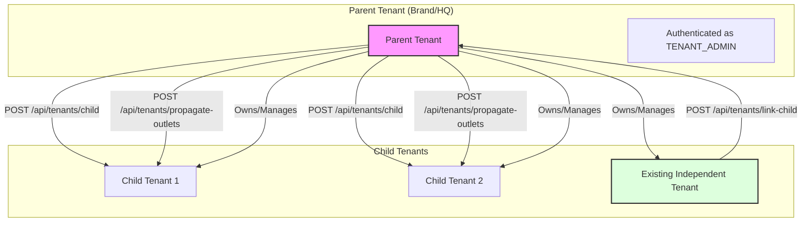

# Tenant Management API

The Tenant Management API allows **TENANT_ADMIN** users to manage the tenancy hierarchy. It supports creating new child tenants, linking existing standalone tenants as children, and propagating master data (like outlets) across multiple child tenants.

This enables multi-level distribution networks (e.g., Brand -> Distributor -> Retailer) where data or configuration can flow downwards.

---

## **1. Create Child Tenant**

Creates a brand new tenant and links it as a child to the current authenticated tenant.

- **URL**: `/api/tenants/child`
- **Method**: `POST`
- **Auth Required**: Yes (`TENANT_ADMIN` role required)

### **Request Body**

| Field | Type | Required | Description |
| :--- | :--- | :--- | :--- |
| `childTenantId` | String | No | Unique ID for the new tenant. If omitted, one is auto-generated. |
| `childTenantName` | String | Yes | Display name of the new tenant. |
| `adminUsername` | String | Yes | Username for the child tenant's initial admin. |
| `adminPassword` | String | Yes | Password for the child tenant's initial admin. |
| `firstName` | String | Yes | First name of the child admin. |
| `lastName` | String | Yes | Last name of the child admin. |
| `email` | String | No | Email of the child admin. |
| `phone` | String | No | Phone of the child admin. |

**Example JSON**:
```json
{
  "childTenantId": "dist_north_01",
  "childTenantName": "North Distributors Ltd",
  "adminUsername": "admin_north",
  "adminPassword": "SecurePass123!",
  "firstName": "John",
  "lastName": "Doe",
  "email": "admin@northdist.com"
}
```

### **Response (201 Created)**

```json
{
  "childTenantId": "dist_north_01",
  "message": "Child tenant created successfully"
}
```

---

## **2. Link Existing Tenant as Child**

Links an already existing (independent) tenant as a child to the current authenticated parent tenant.

- **URL**: `/api/tenants/link-child`
- **Method**: `POST`
- **Auth Required**: Yes (`TENANT_ADMIN` role required)

### **Request Body**

| Field | Type | Required | Description |
| :--- | :--- | :--- | :--- |
| `childTenantId` | String | Yes | The ID of the existing tenant to link. |

**Example JSON**:
```json
{
  "childTenantId": "existing_tenant_123"
}
```

### **Response (200 OK)**

```json
{
  "message": "Child tenant linked successfully"
}
```

---

## **3. List Child Tenants**

Retrieves a list of all tenant IDs that are directly linked as children to the current tenant.

- **URL**: `/api/tenants/children`
- **Method**: `GET`
- **Auth Required**: Yes

### **Response (200 OK)**

```json
{
  "children": [
    "dist_north_01",
    "existing_tenant_123",
    "t_8374928374"
  ]
}
```

---

## **4. Propagate Outlet to Child Tenants**

Replicates an outlet across multiple child tenants. Each child tenant gets an independent copy of the outlet with the same code but different internal IDs.

- **URL**: `/api/tenants/propagate-outlets`
- **Method**: `POST`
- **Auth Required**: Yes (`TENANT_ADMIN` role required)

### **Request Body**

| Field | Type | Required | Description |
| :--- | :--- | :--- | :--- |
| `outlet` | Object | Yes | The outlet data to propagate (see CreateOutletRequest) |
| `outlet.code` | String | Yes | Unique outlet code |
| `outlet.name` | String | Yes | Outlet name |
| `outlet.channel` | String | No | Sales channel (e.g., "GT", "MT") |
| `outlet.address` | String | No | Physical address |
| `outlet.phone` | String | No | Contact phone |
| `outlet.lat` | Number | No | Latitude |
| `outlet.lon` | Number | No | Longitude |
| `targetTenantIds` | Array[String] | Yes | List of child tenant IDs to propagate to |

**Example JSON**:
```json
{
  "outlet": {
    "code": "OUT_001",
    "name": "Downtown Store",
    "channel": "GT",
    "address": "123 Main St",
    "lat": 12.9716,
    "lon": 77.5946
  },
  "targetTenantIds": ["dist_north_01", "dist_south_02"]
}
```

### **Response (200 OK)**

```json
{
  "message": "Outlet propagated successfully"
}
```

### **Notes**

- Each child tenant receives an **independent copy** of the outlet
- Outlets have the same `code` but different `id` values in each tenant
- Uses `ON CONFLICT DO NOTHING` - idempotent (safe to retry)
- Each child can independently modify their copy
- **Hierarchical View**: The parent tenant can fetch all outlets in the hierarchy by calling `GET /outlets?hierarchical=true`. This will return a merged list of outlets from the parent and all its direct children, with the `tenantId` field indicating the source tenant.

### **Propagate Products**

`POST /api/tenants/propagate-products`

Copies a product from the parent tenant to one or more child tenants.

**Request Body:**
```json
{
  "product": {
    "sku": "SKU_001",
    "name": "Global Product",
    "brand": "SONY",
    "category": "ELECTRONICS",
    "uom": "UNIT",
    "unitsPerCase": 10,
    "mrp": 1000.0,
    "active": true,
    "tags": ["GLOBAL"]
  },
  "targetTenantIds": ["child_1", "child_2"]
}
```

**Response:** `200 OK`

**Notes:**
- Uses `ON CONFLICT DO UPDATE` - updates existing product if SKU exists in target tenant
- Ensures catalog consistency across the distribution network
- **Hierarchical View (Default)**: The parent tenant can fetch all products in the hierarchy by calling `GET /products`. To disable and only show local products, use `?hierarchical=false`.
- **Merged Catalog (Default)**: The parent tenant can fetch a consolidated catalog (including prices and entitlements) from the hierarchy by calling `GET /catalog`. This merges results from the parent and all direct children by default.
- **Hierarchical Delivery Dates (Default)**: The parent tenant can fetch next delivery dates for the entire hierarchy by calling `GET /delivery-config/next-date`. This returns an array of next delivery dates for the parent and all its direct children by default. To disable and only show local results, use `?hierarchical=false`.

---

## **5. Organic Tenant Switching**

Parent tenants can perform actions directly on behalf of their child tenants without needing separate credentials. This is achieved by passing the `X-Tenant-Child` header in any API request.

### **How it works**

1.  **Authenticate as Parent**: Use your normal `TENANT_ADMIN` (or authorized user) token.
2.  **Specify Target Child**: Add the `X-Tenant-Child` header with the ID of the child tenant you wish to act upon.
3.  **Automatic Context Switch**: The system verifies that the specified tenant is indeed a child of the authenticated parent. If valid, the request is executed within the scope of the child tenant.

- **Header**: `X-Tenant-Child`
- **Security**: Impersonation is only allowed if the target tenant is a direct child of the authenticated parent. Otherwise, a `401 Unauthorized` response is returned.

### **Example Usage**

To create an outlet directly inside a child tenant using the parent's token:

**Request:**
```http
POST /outlets
Authorization: Bearer <parent_token>
X-Tenant-Id: parent_tenant_id
X-Tenant-Child: child_tenant_abc
Content-Type: application/json

{
  "code": "OUT_001",
  "name": "Direct Child Store",
  ...
}
```

**Results:**
- The outlet is created **only** in `child_tenant_abc`.
- The parent can instantly manage child data using standard endpoints.

---

## **6. Tenant Hierarchy Flow**

Below is a visual representation of how tenants can be structured and managed.



---

## **7. OAuth Client Management**

External applications can be granted access to the tenant's APIs using OAuth 2.0 Credentials.

- **Create Client**: `POST /oauth/clients`
- **List Clients**: `GET /oauth/clients`
- **Revoke Client**: `DELETE /oauth/clients/{id}`

See the [OAuth API Guide](./OAUTH_API.md) for full endpoint details and integration steps.
