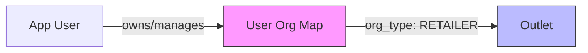
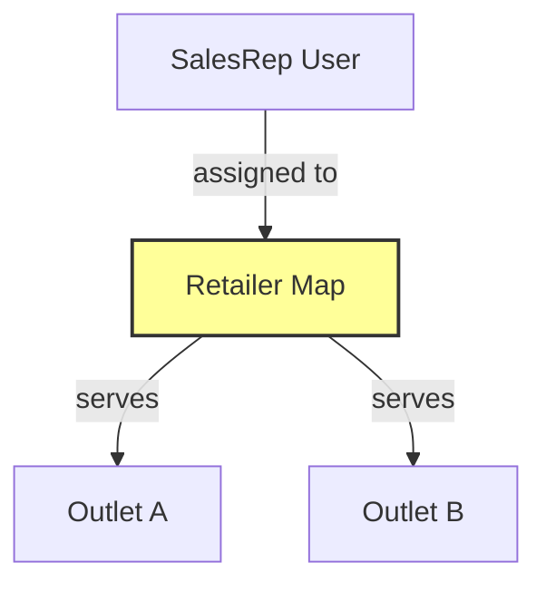
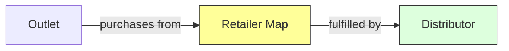
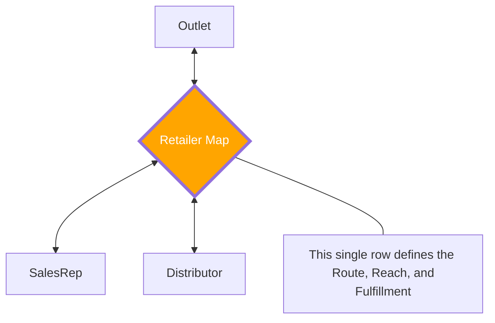
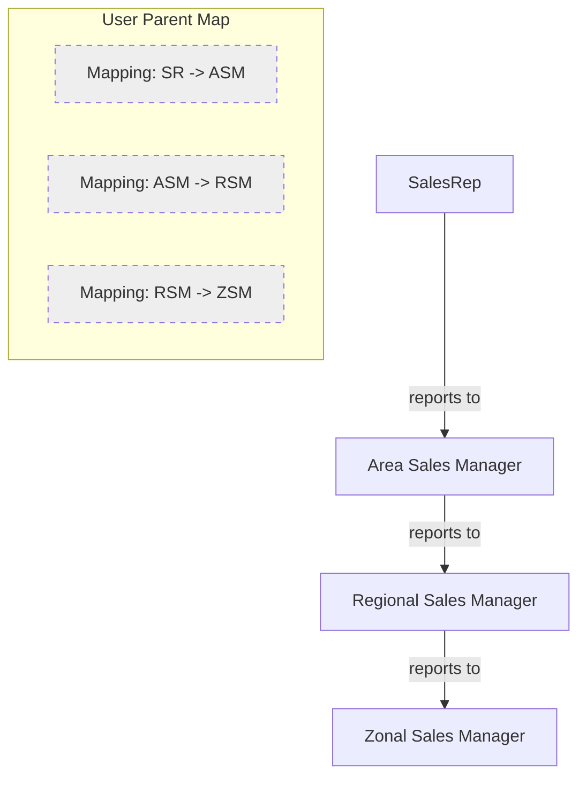

# User Association & Relationship Guide

This guide explains the specific data structures and relationships that drive the Saleshub Lite ecosystem, categorized by functional association.

---

## 1. How Users are Associated with Outlets
When an outlet is created with associated users (like owners or managers), they are linked via the `user_org_map` table.

- **Table:** `user_org_map`
- **Logic:** Connects a `user_id` (username) to an `org_code` (outlet code) with `org_type = 'RETAILER'`.

---

## 2. How Outlets are Associated with SalesReps
This association defines the "Sales Beat" or territory assignment. It tells the system which SalesRep is responsible for taking orders from which outlet.

- **Table:** `retailer_map`
- **Logic:** Maps `outlet_code` to `salesrep_code`.

---

## 3. How Outlets are Associated with Distributors
This defines the supply chain fulfillment. When an order is placed for an outlet, the system knows which distributor should fulfill it.

- **Table:** `retailer_map`
- **Logic:** Maps `outlet_code` to `distributor_code`.

---

## 4. The Business Triad (Combined View)
In practice, the `retailer_map` table acts as the nexus for the Outlet, SalesRep, and Distributor triad.

---

## 5. How Users are Associated with Parents (Hierarchy)
This is a purely administrative/management relationship. It defines the reporting structure (e.g., SalesRep reporting to a Supervisor).

- **Table:** `user_parent_map`
- **Logic:** A child `user_username` reports to a `parent_username`. This supports N-level deep hierarchies.

---

## Relationship Summary Table

| Relationship | Table Used | Key Joining Column 1 | Key Joining Column 2 | Purpose |
| :--- | :--- | :--- | :--- | :--- |
| **User ↔ Outlet** | `user_org_map` | `user_id` | `org_code` | Defines ownership/management access. |
| **Outlet ↔ SalesRep** | `retailer_map` | `outlet_code` | `salesrep_code` | Defines sales assignment (The Beat). |
| **Outlet ↔ Dist** | `retailer_map` | `outlet_code` | `distributor_code` | Defines stock fulfillment source. |
| **User ↔ Parent** | `user_parent_map`| `user_username` | `parent_username` | Defines management reporting (Hierarchy). |
| **Role ↔ User** | `user_role` | `user_id` | `role_id` | Defines system permissions (e.g. Admin). |
