# 📊 Product, Pricing, and Entitlement Graph

This documentation details the relationship graph between Products, Pricing Rules, and Sell Entitlements within the Salescodeai Saleshub platform.

---

## 🔗 Association Graph

The following Mermaid graph visualizes how Products, Distributors, and Outlets connect via Entitlements and Pricing Rules to determine what is visible and at what price.

```mermaid
flowchart LR
    %% Data Sources
    P("📦 Product")
    
    %% Context
    Context("👤 User Context<br/>(Outlet, Dist, Rep)")

    %% Gate 1: Visibility
    subgraph G1 [1. Visibility Check]
        direction TB
        SE("🔐 Sell Entitlement")
        CheckVis{"Is Active?"}
    end

    %% Gate 2: Pricing
    subgraph G2 [2. Price Resolution]
        direction TB
        PR("🏷️ Price Rules")
        Priority("🏆 Priority Logic<br/>1. Outlet + Dist<br/>2. Outlet + Rep<br/>3. Outlet<br/>4. SalesRep<br/>5. Distributor<br/>6. Company (Base)")
    end

    %% Connections
    P --> SE
    Context --> SE
    SE --> CheckVis
    
    P --> PR
    Context --> PR
    PR --> Priority

    %% Outputs
    CheckVis -- Yes --> Final("📝 Final Catalog Entry<br/>(Visible & Priced)")
    CheckVis -- No --> Hidden("🚫 Hidden")
    Priority --> Final

    %% Styling
    classDef input fill:#e3f2fd,stroke:#1565c0,stroke-width:2px;
    classDef process fill:#fff3e0,stroke:#ef6c00,stroke-width:2px,rx:5,ry:5;
    classDef result fill:#e8f5e9,stroke:#2e7d32,stroke-width:2px,rx:5,ry:5;
    classDef hidden fill:#ffebee,stroke:#c62828,stroke-dasharray: 5 5,color:#c62828;

    class P,Context input;
    class SE,CheckVis,PR,Priority process;
    class Final result;
    class Hidden hidden;
```



---

## 📦 1. Product (`Product`)
The foundational master data.
*   **Key Fields**: `id`, `sku` (unique), `mrp`, `unitsPerCase`, `active`.
*   **Role**: Defines *what* is being sold.

---

## 🔐 2. Sell Entitlement (`SellEntitlement`)
Defines **"Who can sell what to whom?"**
It links a **Product** to a **Distributor** (and optionally a specific **Sales Rep** scope), controlling visibility and operational parameters.

### Fields
| Field | Description |
| :--- | :--- |
| `productId` | FK to Product ID. |
| `distributorId` | FK to Distributor ID. |
| `salesrepId` | (Optional) FK to specific Sales Rep. |
| `active` | Boolean. If `false`, the product is **hidden** for this combination. |
| `moqUnits` | Minimum Order Quantity (operational constraint). |
| `leadTimeDays` | Expected delivery time. |

### Logic
*   **Default Visibility**: If no entitlement record exists, the product is usually considered **available** (Open Catalog).
*   **Restrictive**: Explicit `active=false` hides the product.
*   **Granularity**: A SalesRep-specific entitlement overrides a generic distributor entitlement.

---

## 🏷️ 3. Pricing Rule (`PriceRule`)
Defines **"At what price is it sold?"**
A flexible rule engine that resolves the best price based on the context (Outlet, Distributor, SalesRep) and time.

### Fields
| Field | Description |
| :--- | :--- |
| `productId` | Text. Matches Product **SKU**. |
| `scope` | Enum. Defines specificity (see priority below). |
| `outletCode` | Matches Outlet. |
| `distributor` | Matches Distributor Code. |
| `salesrep` | Matches Sales Rep Username. |
| `priceUnit`, `priceCase` | The actual price values. |
| `startOn`, `endOn` | Validity date range. |

### Scope Priority (Resolution Logic)
The system calculates the price by checking rules in this strict order. The first valid rule found wins.

1.  **`OUTLET_DISTRIBUTOR`**: Specific price for an outlet buying from a specific distributor.
2.  **`OUTLET_SALESREP`**: Specific price for an outlet served by a specific sales rep.
3.  **`OUTLET`**: Specific price for an outlet (any distributor).
4.  **`SALESREP`**: Standard price for a sales rep's beat.
5.  **`DISTRIBUTOR`**: Standard price for a distributor.
6.  **`COMPANY`**: Base list price (Global default).

---

## 🛒 4. Catalog Resolution (`get_catalog` Function)
The `get_catalog` SQL function effectively "draws" this graph dynamically for every request.

### Inputs
*   `Outlet Code`
*   `Distributor Code` (Derived or explicit)
*   `Sales Rep` (Authenticated user)
*   `Date` (As-Of)

### Output
A projection of the **Product** with:
*   **`entitlement_active`**: Computed from `SellEntitlement`.
*   **`price_unit`**: Computed from the winning `PriceRule`.
*   **`price_scope_used`**: Which rule won (for transparency).

### Example SQL Flow
```sql
SELECT 
  p.sku, 
  p.name,
  COALESCE(ent.active, TRUE) as is_visible,
  best_price.price_unit
FROM product p
LEFT JOIN sell_entitlement ent ON ...
LEFT JOIN LATERAL (
  SELECT * FROM price_rule pr
  WHERE pr.product_id = p.sku
  ORDER BY pr.scope_rank ASC -- (1=OUTLET_DISTRIBUTOR ... 6=COMPANY)
  LIMIT 1
) best_price ON true
```
