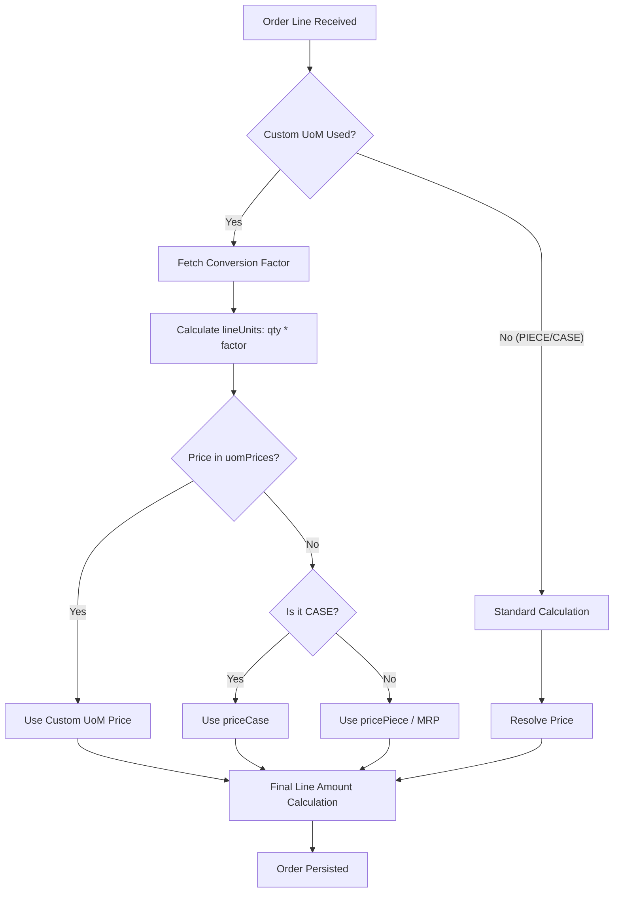

# Unit of Measure (UoM) Support in Sales Lite

Sales Lite provides a robust and flexible system for managing Units of Measure (UoM). It has evolved from a fixed enum-based system to a fully customizable framework that supports arbitrary UoMs with per-product conversion factors and specific pricing.

## 1. Core Architecture

The UoM system is built on three pillars:
1.  **Flexible UoM Labels**: The `uom` field in Products, Price Rules, and Orders is now a standard `TEXT` field, allowing values like `BOX`, `TRAY`, `CRATE`, `BUNDLE`, etc.
2.  **Conversion Factors**: A dedicated mapping table manages how many "Base Units" (usually `PIECE`) are contained within a specific UoM for a given SKU.
3.  **Specific Pricing**: Price Rules can define distinct prices for different UoMs using a JSONB price map.

---

## 2. Custom UoM Conversions

Every product has a "Base UoM" (defaulting to `PIECE`). To support other units, you define a conversion factor.

### Database Schema (`product_uom_conversion`)
| Column | Type | Description |
| :--- | :--- | :--- |
| `sku` | `TEXT` | The product identifier. |
| `uom` | `TEXT` | The custom label (e.g., `BOX`). |
| `conversion_factor` | `NUMERIC` | Number of base units in this UoM. |
| `base_uom` | `TEXT` | The reference unit (default `PIECE`). |

**Example**:
For SKU `PROD_001`:
*   `BOX` -> `12.0` (1 Box = 12 Pieces)
*   `TRAY` -> `24.0` (1 Tray = 24 Pieces)

---

## 3. Pricing Resolution Logic

When an order line is processed, the system resolves the price and total units based on the requested UoM.

### Precedence for Price Selection:
1.  **Custom UoM Price**: If the `price_rule` has a specific price for the requested UoM in its `uom_prices` map.
2.  **Case Price**: If the requested UoM is `CASE` or matches the product's primary UoM.
3.  **Piece/Unit Price**: The standard piece-level price.
4.  **MRP**: Fallback if no matching price rule is found.

---

## 4. Operational Flow

The following graph illustrates how a custom UoM order line is processed:



---

## 5. API Usage

### Defining a Conversion
`POST /products/{sku}/uom-conversions`
```json
{
  "uom": "BOX",
  "conversionFactor": 12.0,
  "baseUom": "PIECE"
}
```

### Defining Per-UoM Prices
When creating a price rule, use the `uomPrices` map:
`POST /price-rules`
```json
{
  "productId": "SKU_001",
  "scope": "COMPANY",
  "pricePiece": 10.0,
  "uomPrices": {
    "BOX": 110.0,
    "TRAY": 210.0
  }
}
```
*In this case, a BOX is slightly cheaper (110) than buying 12 individual pieces (120).*
