# 🎓 Complete Order Lifecycle Training Guide

This comprehensive guide walks you through the entire end-to-end flow of the SalesHub platform—from onboarding a new retailer to placing a complex promotional order.

---

## 🗺️ The Master Flow

The following diagram visualizes every step in the lifecycle. Follow the arrows to understand the dependencies and sequence of operations.

```mermaid
flowchart TD
    %% Styling
    classDef actor fill:#e1f5fe,stroke:#01579b,stroke-width:2px;
    classDef entity fill:#fff3e0,stroke:#e65100,stroke-width:2px,rx:5,ry:5;
    classDef decision fill:#fce4ec,stroke:#880e4f,stroke-width:2px,rx:5,ry:100;
    classDef process fill:#e8f5e9,stroke:#1b5e20,stroke-width:2px;
    classDef final fill:#333,stroke:#000,stroke-width:2px,color:#fff;

    Start((Start)) --> UserReg

    subgraph Phase1 [Phase 1: Onboarding]
        direction TB
        UserReg("👤 1. Register User<br/>(Retailer)")
        OutletReg("🏪 2. Register Outlet<br/>(Link to User)")
        
        CheckSR{"3. Need SalesRep?"}
        
        CreateSR("👨‍💼 3a. Create SalesRep")
        CreateDist("🚚 4. Create Distributor")
    end

    subgraph Phase2 [Phase 2: Association]
        direction TB
        MapDirect("🔗 5a. Map: Outlet ↔ Distributor<br/>(Direct Coverage)")
        MapIndirect("🔗 5b. Map: Outlet ↔ SR ↔ Distributor<br/>(Sales Beat)")
    end

    subgraph Phase3 [Phase 3: Catalog & Pricing]
        direction TB
        PriceLevel{"6. Pricing Strategy?"}
        PriceBase("🏷️ Base Price<br/>(Company Level)")
        PriceDist("🏷️ Distributor Price")
        PriceOutlet("🏷️ Specific Outlet Price")
        
        Entitle("🔐 7. Entitlements<br/>(Activate Products for Dist)")
    end

    subgraph Phase4 [Phase 4: Marketing]
        direction TB
        Promo("🎁 8. Configure Promotions<br/>(Rules, Conditions, Benefits)")
    end

    subgraph Phase5 [Phase 5: Execution]
        direction TB
        CatalogResolved("📚 Catalog Resolved<br/>(Visbility + Price + Promo)")
        PlaceOrder("🛒 9. Place Order<br/>(Validation & Calculation)")
    end

    %% Flow Connections
    UserReg --> OutletReg
    OutletReg --> CheckSR
    
    CheckSR -- Yes --> CreateSR
    CreateSR --> CreateDist
    CreateDist --> MapIndirect
    
    CheckSR -- No --> CreateDist
    CreateDist --> MapDirect

    MapDirect --> PriceLevel
    MapIndirect --> PriceLevel

    PriceLevel -- Complex --> PriceOutlet
    PriceLevel -- Standard --> PriceDist
    PriceLevel -- Global --> PriceBase

    PriceBase --> Entitle
    PriceDist --> Entitle
    PriceOutlet --> Entitle

    Entitle --> Promo
    Promo --> CatalogResolved
    CatalogResolved --> PlaceOrder
    PlaceOrder --> End((End))

    %% Class Assignments
    class UserReg,CreateSR,CreateDist actor;
    class OutletReg,Entitle,Promo,CatalogResolved entity;
    class CheckSR,PriceLevel decision;
    class MapDirect,MapIndirect,PlaceOrder process;
    class End final;
```

---

## 📝 Step-by-Step Breakdown

### Phase 1: Onboarding Entities

#### 1. Register User (`POST /auth/user-register`)
Create the login credentials for the Retailer. 
*   **Inputs**: Username, Password, Name, Phone.
*   **Notes**: Use `otpEnabled: true` for phone verification flows.

#### 2. Register Outlet (`POST /outlets`)
Create the physical store and link it to the User created in step 1.
*   **Inputs**: Name, Address, **Pincode**, Lat/Lon.
*   **Key**: The `pincode` is crucial for location-based reporting.

#### 3. SalesRep Assessment
Determine the coverage model:
*   **Direct Coverage**: The Retailer orders directly from the Distributor (Self-Ordering).
*   **Assisted Coverage**: A SalesRep visits the Outlet to take orders.

#### 4. Create Distributor (`POST /distributors`)
Set up the fulfillment partner.
*   **Inputs**: Code, Name, Warehouse Address.

---

### Phase 2: Mapping & Relationships

#### 5. Retailer Mapping (`POST /retailer-map`)
This is the "glue" that creates the network. Using the `RetailerMap` table, we define the valid routes.

*   **Scenario A (Direct)**: Map `Outlet Code` + `Distributor Code`.
*   **Scenario B (Assisted)**: Map `Outlet Code` + `SalesRep Code` + `Distributor Code`.

---

### Phase 3: Product, Pricing & Entitlements

#### 6. Setup Pricing (`POST /pricing`)
Define the Price Rules. The engine looks for the "Best Match".
*   **Company Level**: `scope: COMPANY` (MSRP).
*   **Distributor Level**: `scope: DISTRIBUTOR` (Regional pricing).
*   **Outlet Level**: `scope: OUTLET` (Negotiated rates).

#### 7. Entitlements (`POST /entitlements`)
Explicitly allow the Distributor to sell specific Products.
*   **Action**: Link `Product SKU` + `Distributor ID`.
*   **Flag**: Set `active: true` to make it visible in the catalog.

---

### Phase 4: Promotions & Marketing

#### 8. Configure Promotions (`POST /promotions`)
Create incentives to drive sales.
*   **Structure**: `Promotion` -> `Rule` -> `Filter` -> `Condition` -> `Benefit`.
*   **Example**: "Buy 10 Cases of Coke, Get 5% Off".
    *   **Filter**: SKU = Coke.
    *   **Condition**: Qty >= 10.
    *   **Benefit**: 5% Discount.

---

### Phase 5: Execution

#### 9. Place Order (`POST /orders`)
The culmination of the flow.
1.  **Catalog Check**: The system checks Entitlements to ensure products are Sellable.
2.  **Price Check**: The system resolves the specific Price Rule.
3.  **Promo Engine**: The system evaluates the cart against Promotion Rules.
4.  **Finalization**: Total is calculated, and the Order is saved.

---
