# 🏷️ Promotion Engine Guide

This document explains the architecture and usage of the Salescodeai Saleshub Promotion Engine. It details how to construct promotions using Rules, Conditions, and Benefits, complete with complex examples.

---

## 🏗️ Architecture Overview

The Promotion Engine is built on a hierarchical model:


### 1. Promotion (`Promotion`)
The container for the marketing campaign.
*   **Kind**: `SLAB_SCHEME`, `ORDER_DISCOUNT`, `ITEM_DISCOUNT`, `FREE_GOODS`.
*   **Stackable**: Global flag determining if benefits from this promotion can coexist with others.

### 2. Rule (`PromotionRule`)
A logic unit within a promotion. A promotion can have multiple rules.
*   **Scope**: `ORDER` (evaluates whole order) or `ITEM` (evaluates per line item).
*   **Priority**: Rules are evaluated in sequence.

### 3. Filters (`RuleFilter`)
Defines **"What items does this rule apply to?"**
*   **Scope**: `ORDER_LINE`
*   **Field**: `sku`, `category`, `brand`, etc.
*   **Op**: `IN`, `NOT_IN`.
*   **Example**: `sku IN ["SKU001", "SKU002"]` (Only considers these SKUs for conditions/benefits).

### 4. Conditions (`RuleCondition`)
Defines **"When does this rule trigger?"** (Thresholds & Slabs).
Conditions are grouped by `slabIndex`. ALL conditions for a specific `slabIndex` must be met.
*   **Basis**:
    *   `BASKET_QTY` / `BASKET_VALUE`: Total quantity/value of *filtered* items.
    *   `SKU_QTY:<code>`: Quantity of a specific SKU among the filtered items.
    *   `LINE_QTY` / `LINE_VALUE`: Quantity/Value of the current line (for ITEM scope).
*   **SlabIndex**: Integer (0, 1, 2...) linking this condition to a specific benefit level.
*   **MinValue / MaxValue**: The range for the condition to return true.

### 5. Benefits (`RuleBenefit`)
Defines **"What matches the user get?"**
Linked to conditions via `slabIndex`.
*   **Type**: `PERCENT_DISCOUNT`, `FLAT_DISCOUNT`, `FREE_GOODS`, `POINTS`.
*   **Scope**:
    *   `ORDER`: Applies to the order total (gross amount of filtered items).
    *   `ORDER_LINE`: Applies to the individual matching lines.
*   **Value Fields**: `percentOff`, `flatOff`, `freeSku`, `freeQty`.

---

## 🧩 Complex Example: Mixed Benefits

The following example demonstrates a sophisticated `SLAB_SCHEME` promotion.
**Scenario**: "Buy any 4 items from the Combo list (SKU001, SKU002). If you specifically have at least 2 of SKU001, you get **10% OFF the order** AND **1 Free SKU004**."

### JSON Configuration

```json
{
  "promotion": {
    "code": "COMBO_DEAL_001",
    "name": "Combo: Percent Discount + Free Goods",
    "kind": "SLAB_SCHEME",
    "status": "ACTIVE",
    "stackable": true
  },
  "rules": [
    {
      "scope": "ORDER",
      "filters": [
        {
          "scope": "ORDER_LINE", 
          "field": "sku", 
          "op": "IN", 
          "values": ["SKU001", "SKU002"]
        }
      ],
      "conditions": [
        {
          "basis": "BASKET_QTY", 
          "slabIndex": 0, 
          "minValue": 4
        },
        {
          "basis": "SKU_QTY:SKU001", 
          "slabIndex": 0, 
          "minValue": 2
        }
      ],
      "benefits": [
        {
          "scope": "ORDER", 
          "type": "PERCENT_DISCOUNT", 
          "slabIndex": 0, 
          "percentOff": 10
        },
        {
          "scope": "ORDER_LINE", 
          "type": "FREE_GOODS", 
          "slabIndex": 0, 
          "freeSku": "SKU004", 
          "freeQty": 1
        }
      ]
    }
  ]
}
```

### Logic Flow Diagram

```mermaid
sequenceDiagram
    participant Engine
    participant Filter as Filter(sku in SKU001,002)
    participant Cond1 as Condition(BASKET_QTY >= 4)
    participant Cond2 as Condition(SKU_QTY:SKU001 >= 2)
    participant Ben1 as Benefit(10% Off)
    participant Ben2 as Benefit(Free SKU004)

    Engine->>Filter: Check Order Lines
    Filter-->>Engine: Returns [Line(SKU001, qty=2), Line(SKU002, qty=2)]
    
    Engine->>Cond1: Check Total Qty (2+2 = 4)
    Cond1-->>Engine: ✅ True (4 >= 4)
    
    Engine->>Cond2: Check SKU001 Qty
    Cond2-->>Engine: ✅ True (2 >= 2)
    
    rect rgb(200, 255, 200)
    Note over Engine: All Conditions Met for Slab 0
    end
    
    Engine->>Ben1: Apply Order Discount
    Ben1-->>Engine: Discount = (4 * UnitPrice) * 10%
    
    Engine->>Ben2: Add Free Goods
    Ben2-->>Engine: Add Line: SKU004 (qty=1, price=0)
```



### Explanation
1.  **Filters**: The engine first isolates the lines relevant to this rule. It ignores SKU003, SKU004, etc. It only sees SKU001 and SKU002.
2.  **Condition 1 (`BASKET_QTY`)**: It sums the quantities of the *filtered* lines. 2 (SKU001) + 2 (SKU002) = 4. Since 4 >= 4, this condition matches.
3.  **Condition 2 (`SKU_QTY:SKU001`)**: It looks specifically at SKU001 within the filtered set. Quantity is 2. Since 2 >= 2, this condition matches.
4.  **Result**: Since **BOTH** conditions for `slabIndex: 0` are true, the engine triggers all benefits associated with `slabIndex: 0`.
5.  **Benefit 1**: 10% discount is calculated on the total value of the *filtered* items.
6.  **Benefit 2**: A free item line (SKU004) is added to the cart.

---

## 📐 Data Models

### Promotion Rule (`PromotionRule`)
| Field | Type | Description |
| :--- | :--- | :--- |
| `scope` | Enum | `ORDER` (Basket level) or `ITEM` (Line level) |
| `filters` | List | Criteria to select eligible items |
| `conditions` | List | Thresholds for slabs |
| `benefits` | List | Rewards/outcomes |

### Rule Condition (`RuleCondition`)
| Field | Type | Description |
| :--- | :--- | :--- |
| `basis` | String | Logic basis: `BASKET_QTY`, `BASKET_VALUE`, `SKU_QTY:<code>`, `LINE_QTY` |
| `slabIndex` | Integer | Grouping index for benefits |
| `minValue` | Decimal | Minimum threshold (inclusive) |
| `maxValue` | Decimal | Maximum threshold (inclusive, optional) |

### Rule Benefit (`RuleBenefit`)
| Field | Type | Description |
| :--- | :--- | :--- |
| `type` | Enum | `PERCENT_DISCOUNT`, `FLAT_DISCOUNT`, `FREE_GOODS`, `POINTS` |
| `scope` | Enum | `ORDER` (Apply to basket total), `ORDER_LINE` (Apply to lines / add specific line) |
| `slabIndex` | Integer | Must match the successful condition's slabIndex |
| `percentOff` | Decimal | Percentage value (e.g., 10.0 for 10%) |
| `flatOff` | Decimal | Absolute currency value |
| `freeSku` | String | Product code for free goods |
| `freeQty` | Integer | Quantity of free goods |

