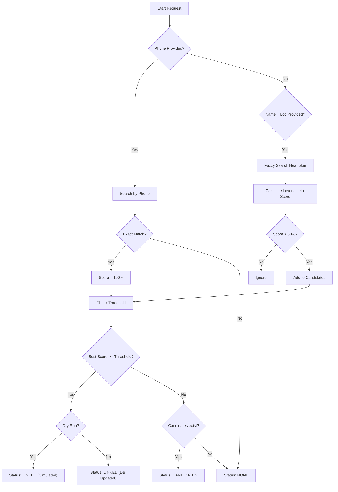

# ⚡ Unification API Documentation

**Service Name:** `salesdblite-unification-service`

The Unification Service provides capabilities for users (typically retailers) to discover and claim existing outlets in the system. This is crucial for preventing data duplication by allowing users to link to pre-verified outlets rather than creating new ones.

---

## Endpoints

| Method | Endpoint | Description | Auth Required |
|--------|----------|-------------|---------------|
| `POST` | `/unification/unify` | Unify user with existing outlet | ✅ |

---

### POST /unification/unify

Attempts to link the authenticated user to an existing outlet using either **Direct Match (Phone)** or **Fuzzy Match (Name + Location)**.

### Process Flow



#### Matching Logic

1.  **Direct Match (Phone)**:
    -   If a `phone` number is provided, the system searches all accessible tenants (including child tenants) for an exact match.
    -   If a match is found, the user is **automatically linked** to that outlet.
    -   This is the highest confidence match type.

2.  **Fuzzy Match (Name + Location)**:
    -   If `name`, `lat`, and `lon` are provided (and no phone match is found), the system performs a proximity search.
    -   **Scope**: Searches for outlets within a **5km radius** of the provided coordinates.
    -   **Scoring**: Calculates a similarity score based on the Levenshtein distance between the outlet names.
    -   **Result**: Returns a list of potential candidates where the match confidence is **> 50%**.
    -   The user is **not** automatically linked; they must manually select a candidate (future flow).

#### Query Parameters

| Parameter | Type | Required | Default | Description |
|-----------|------|----------|---------|-------------|
| `dryRun` | `boolean` | No | `false` | If `true`, the system performs the search and validation logic but acts as a simulation. It will **not** create any actual database links, even for a perfect phone match. The response will indicate what *would* have happened. |
| `threshold` | `int` | No | `100` | Minimum match percentage required to automatically link the user to the outlet. If the best match score >= threshold, the status will be `LINKED` and the link created (unless dryRun). Default is 100, meaning only direct phone matches auto-link by default. Lowering this (e.g., to 90) allows high-confidence fuzzy matches to auto-link. |

#### Request Body

| Field | Type | Required | Description | Example |
|-------|------|----------|-------------|---------|
| `phone` | `string` | No* | Exact phone number to match. (*Required if Name/Lat/Lon not provided) | `9876543210` |
| `name` | `string` | No* | Outlet name for fuzzy matching. (*Required if Phone not provided) | `Shama Gen Store` |
| `lat` | `float` | No* | Latitude for proximity search. | `19.0760` |
| `lon` | `float` | No* | Longitude for proximity search. | `72.8777` |
| `limit` | `int` | No | Max number of candidates to return (default 5). | `5` |

**Response Format**

The response contains a `status` field which dictates the outcome:
-   `LINKED`: Exact match found and user linked (or would be linked in dryRun).
-   `CANDIDATES`: Potential matches found, returns a list for selection.
-   `NONE`: No matches found.

All results, whether exact links or potential candidates, are returned in the `matches` list.

---

### Examples

#### 1. Success (Direct Link)
*Scenario: User provides their phone number, which matches an existing outlet exactly.*

**Request:**
```http
POST /unification/unify
Authorization: Bearer <token>
Content-Type: application/json

{
  "phone": "9876543210"
}
```

**Response (200 OK):**
```json
{
  "status": "LINKED",
  "matches": [
      {
        "outlet": {
            "code": "OUT_123",
            "name": "Sharma General Store",
            "phone": "9876543210",
            "lat": 19.0760,
            "lon": 72.8777
        },
        "tenantId": "dhaneesh_master",
        "matchPercentage": 100,
        "distanceKm": 0.0
      },
       {
        "outlet": {
            "code": "OUT_123",
            "name": "Sharma General Store",
            "phone": "9876543210",
            "lat": 19.0760,
            "lon": 72.8777
        },
        "tenantId": "dhaneesh_child",
        "matchPercentage": 100,
        "distanceKm": 0.0
      }
  ],
  "message": "Successfully linked by phone number."
}
```

#### 2. Fuzzy Candidates
*Scenario: User provides a slightly misspelled shop name and their location.*

**Request:**
```http
POST /unification/unify
Authorization: Bearer <token>
Content-Type: application/json

{
  "name": "Shama Store",
  "lat": 19.07,
  "lon": 72.87
}
```

**Response (200 OK):**
```json
{
  "status": "CANDIDATES",
  "matches": [
    {
      "outlet": {
        "code": "OUT_123",
        "name": "Sharma General Store",
        "address": "123 Main St",
        "lat": 19.0760,
        "lon": 72.8777
      },
      "tenantId": "dhaneesh_master",
      "matchPercentage": 85,
      "distanceKm": 0.5
    },
    {
      "outlet": {
        "code": "OUT_456",
        "name": "Shama Retails",
        ...
      },
      "tenantId": "dhaneesh_child",
      "matchPercentage": 60,
      "distanceKm": 1.2
    }
  ],
  "message": "Found potential matches."
}
```

#### 3. Dry Run Simulation
*Scenario: Testing the unification logic without committing changes.*

**Request:**
```http
POST /unification/unify?dryRun=true
Authorization: Bearer <token>
Content-Type: application/json

{
  "phone": "9876543210"
}
```

**Response (200 OK):**
```json
{
  "status": "LINKED",
  "matches": [
     {
        "outlet": {
            "code": "OUT_123",
            "name": "Sharma General Store",
            ...
        },
        "tenantId": "dhaneesh_master",
        "matchPercentage": 100,
        "distanceKm": 0.0
     }
  ],
  "message": "Dry Run: Would be linked by phone number."
}
```
