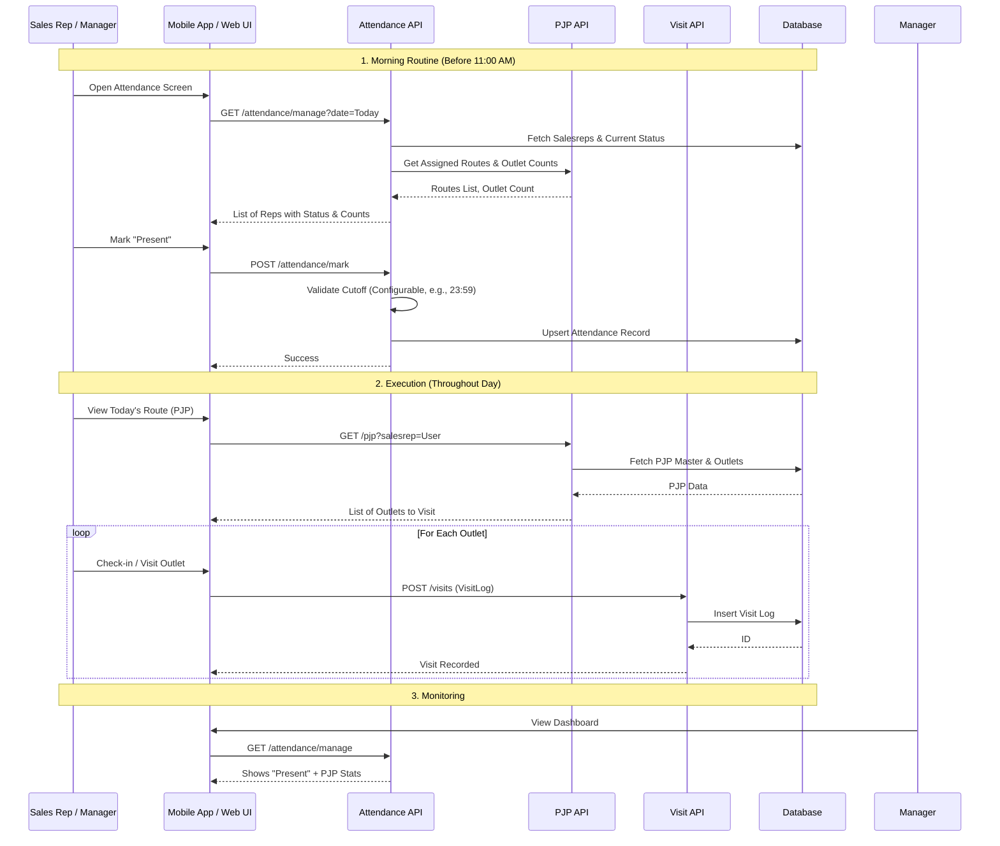

# Attendance & PJP Integration Documentation

This document outlines the relationship between **Attendance Management** and **Permanent Journey Plan (PJP)** in the Sales Lite application. It describes how sales representatives' daily activities are planned via PJP, initiated via Attendance, and tracked via Visit Logs.

## 1. Overview

The Sales Lite system uses **PJP** to define *where* a sales representative should be on any given day, and **Attendance** to record *if* they are actually working. **Visit Logs** captured actual field execution.

### Key Concepts

| Concept | Description | Key Modules/APIs |
| :--- | :--- | :--- |
| **Attendance** | Records daily presence (Present/Absent). Prerequisite for starting PJP execution. | `AttendanceResource`, `SalesrepAttendanceDao` |
| **PJP (Plan)** | Defines the recurring schedule of outlets to visit. Linked to Beats/Routes. | `PjpResource`, `PjpMaster` |
| **Visit (Actual)** | The actual execution of a visit to an outlet. Proves the PJP compliance. | `VisitLogResource`, `VisitLog` |

---

## 2. Attendance Module

The Attendance module tracks the daily status of sales representatives.

### Key Features
1.  **Marking Attendance**:
    *   **Bulk Mark**: `POST /attendance/mark?date=YYYY-MM-DD`
        *   **Request Body**:
            ```json
            [
              { "salesrepCode": "srep1", "attendanceStatus": "Present" },
              { "salesrepCode": "srep2", "attendanceStatus": "Absent" }
            ]
            ```
        *   **Response**: `{"status": "ok"}`
    *   **Simple Mark**: `POST /attendance/mark-status?salesrep=...&status=...&date=...`
        *   **Query Params**: 
            *   `salesrep` (optional): Defaults to logged-in user.
            *   `status` (optional): `Present` (default) or `Absent`.
            *   `date` (optional): Defaults to today.
        *   **Response**:
            ```json
            {
              "status": "ok",
              "salesrep": "srep1",
              "date": "2026-02-02",
              "isPresent": true
            }
            ```
    *   **Logic**:
        *   **Cutoff Time**: Attendance for the current day can be modified until end of day (23:59) by default.
        *   **Past Dates**: Locked; cannot be modified retroactively via API.
        *   **Security**: Sales reps can only mark their own attendance via `mark-status`.
2.  **Managing Attendance**:
    *   **Endpoints**: 
        *   `GET /attendance/manage?date=YYYY-MM-DD&hierarchical=true`
        *   `GET /attendance?date=YYYY-MM-DD&hierarchical=true` (Default: `hierarchical=true`)
    *   **Response Format**:
        ```json
        {
          "results": [
            {
              "salesrepCode": "srep1",
              "salesrepName": "Srep One",
              "attendanceStatus": "Present",
              "assignedRoutes": ["Route A", "Route B"],
              "outletsAssigned": 15,
              "tenantId": "tenant1"
            }
          ]
        }
        ```
    *   **Logic**:
        *   Lists sales representatives for a given date.
        *   **Hierarchical View**: If `hierarchical=true` (default), results include the current tenant and all child tenants.
        *   **Role-Based Visibility**:
            *   `ADMIN` / `TENANT_ADMIN`: Sees all sales reps in the tenant(s).
            *   `DISTRIBUTOR`: Sees sales reps assigned to their distributor code.
            *   `RETAILER`: Sees sales reps associated with their outlets (cross-tenant if hierarchical).
        *   Shows current status (`Present`, `Absent`, or `Not Marked`).
        *   Shows **Outlets Assigned** count and **Assigned Routes** names (derived from PJP).
3.  **MDM Upload**:
    *   **Endpoint**: `POST /master/upload/multipart?entityType=SALESREP_ATTENDANCE`
    *   **Format**: CSV (`salesrep_code`, `date`, `status`, `remarks`).
    *   **Use Case**: Batch upload of attendance data from external HR systems or manual sheets.

---

## 3. Permanent Journey Plan (PJP)

PJP defines the *planned* work. It is a recurring schedule.

### Structure
*   **PjpMaster**: The header containing:
    *   `salesrep`: The assigned user.
    *   `frequency`: Typically `MONTHLY`.
    *   `week1` to `week6`: Arrays of weekday codes (e.g., `["MON", "WED"]`).
*   **PjpOutletMapItem**: The list of outlets for that plan, ordered by `sequenceNo`.

### Retrieval
*   **Endpoint**: `GET /pjp?salesrepUsername=...`
*   **Logic**: Returns the PJP definition.
*   **Status Summary**:
    *   **Endpoint**: `GET /visit-plan/visit-status?salesrep=...&date=...`
    *   **Logic**: Provides a holistic view of the rep's status (Attendance + Route Name + Completion %).

---

## 4. Visit Execution (The "Flow")

The operational flow for a Sales Representative follows this sequence:

1.  **Day Start**: Salesrep logs in.
2.  **Attendance**: Salesrep (or Manager) marks status as **Present**.
3.  **Get Plan**: System fetches valid PJP for today based on day of week/month.
4.  **Execute**: Salesrep visits outlets in the list.
5.  **Log Visit**:
    *   **Endpoint**: `POST /visits`
    *   **Data**: `outletCode`, `salesrepUsername`, `date`, `latitude`, `longitude`.
    *   **Logic**: Records the visit timestamp. Can optionally validate geofencing against Outlet location.

---

## 5. Implementation Flow Diagram

The following Mermaid diagram illustrates how these components interact during a typical working day.



## 6. Data Integration Points

*   **PJP -> Attendance**: Attendance API calls PJP DAO to populate "Assigned Routes" and "Outlet Counts" to give context to managers approving attendance.
*   **Attendance -> Visits**: (Logical Dependency) Visits should arguably strictly be allowed only if Attendance is "Present", though currently this is a soft dependency managed by the frontend workflow.
