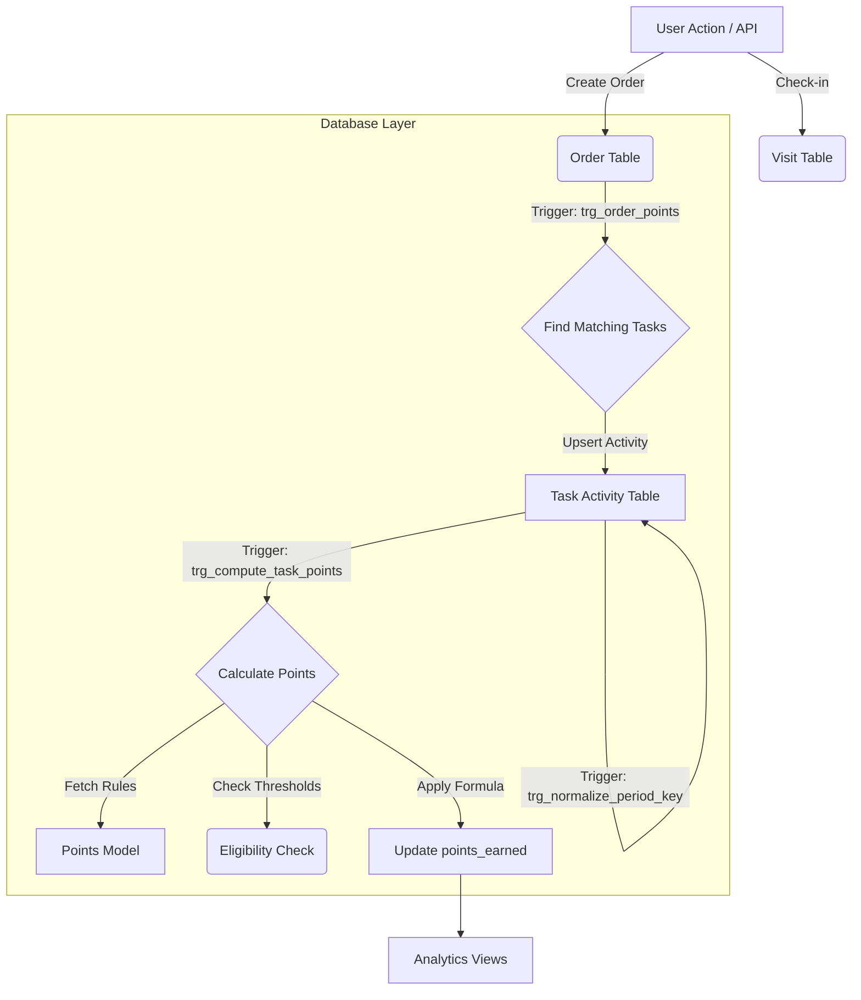

# Task Engine Architecture & API

The **Task Engine** enables gamification within the sales application, allowing the definition of tasks, points models, and the tracking of activities to award points to users. It supports highly configurable rules for point generation based on various activities like order values, visit counts, or specific product sales.

## 1. Design & Concepts

### 1.1 Points Model (`points_model`)
The Points Model defines *how* points are calculated. It serves as a reusable strategy or formula that can be attached to multiple tasks.

*   **Code**: Unique identifier for the model (e.g., `ORD_VAL_1PCT`).
*   **Kind**: The logic type for calculation.
*   **Parameters**:
    *   `base_points`: Fixed points awarded upon completion.
    *   `per_unit_points`: Points per unit of activity (e.g., per visit, per case).
    *   `percent_factor`: Multiplier for value-based metrics (e.g., 0.01 for 1% of order value).
    *   `min_units_threshold`: Minimum units required to qualify.
    *   `min_value_threshold`: Minimum value required to qualify.
    *   `sku_whitelist/sku_blacklist`: JSON lists to filter eligible products.

#### Supported Points Kinds (`points_kind`)
*   `ORDER_VALUE`: Based on the monetary value of an order.
*   `ORDER_COUNT`: Based on the number of orders.
*   `PRODUCT_PURCHASE`: Based on buying specific products (supports SKU-specific bonuses).
*   `VISIT`: Per visit.
*   `VISIT_COUNT`: Aggregate count of visits.
*   `UPSELL`: Selling higher value items.
*   `CROSS_SELL`: Selling complementary items.
*   `MUST_SELL_COUNT`: Selling mandatory SKUs.
*   `FOCUS_PRODUCT_COUNT`: Selling focus/promotional SKUs.
*   `GENERIC`: Flexible counter.

### 1.2 Task (`task`)
A Task is a specific instance of a goal assigned to users. It binds a **Points Model** to a specific entity scope and frequency.

*   **Frequency**: `DAILY` or `MONTHLY`.
*   **Applies To**: Scope of assignment (`task_scope_kind`).
    *   `ALL`: Global task for everyone.
    *   `OUTLET`: Specific outlet (retailer).
    *   `SALESREP`: Specific sales representative.
    *   `DISTRIBUTOR`: Specific distributor.
*   **Audit**: Tracks `createdBy` and `updatedBy`.
*   **Foreign Keys**: `points_model_id` (Required).

### 1.3 Task Activity (`task_activity`)
Represents the actual progress or completion of a task by a user for a specific period.

*   **Assignee**: username/code of the person performing the task.
*   **Period Key**: The date (Daily) or Month start date (Monthly) the activity belongs to.
*   **Status**: `PENDING`, `DONE`, etc.
*   **Metrics**: `units_done`, `value_done`, `product_sku`.
*   **Result**:
    *   `eligible`: Computed boolean indicating if thresholds were met.
    *   `points_earned`: The calculated points based on the underlying Points Model.

---

## 2. Logic Flow & Automation

The engine is designed to be **event-driven** and **database-centric**. Points are calculated in real-time as activities occur.

### Flow Graph



### Automation Details
1.  **Order Trigger**: When an order is placed (`INSERT` on `order`), `trg_order_points` fires.
    *   It scans for active Tasks applicable to the Order's SalesRep, Outlet, or Distributor.
    *   It inserts or updates a record in `task_activity` for the current Date/Month.
    *   It increments `units_done` (for counts) and `value_done` (for value).
    *   It sets status to `DONE`.

2.  **Points Calculation Trigger**: When `task_activity` is touched, `trg_compute_task_points` fires.
    *   It reads the linked `PointsModel`.
    *   It validates `min_units_threshold` and `min_value_threshold`.
    *   It computes the final points: 
        `Points = Base + (PerUnit * Units) + (Percent * Value)`
    *   It updates the `eligible` flag and `points_earned`.

---

## 3. API Reference

All endpoints require standard authentication headers:
- `Authorization`: `Bearer <token>`
- `X-Tenant-Id`: `<tenant_id>`

### 3.1 Points Models

#### List Points Models
**GET** `/api/points-models`

**Response**:
```json
[
  {
    "id": 1,
    "code": "ORD_VAL_1PCT",
    "kind": "ORDER_VALUE",
    "description": "1% of Value, Min 1k",
    "basePoints": 0,
    "perUnitPoints": 0,
    "percentFactor": 0.01,
    "minValueThreshold": 1000,
    "skuWhitelist": null
  }
]
```

#### Upsert Points Model
**PUT** `/api/points-models`

**Payload**:
```json
{
  "code": "VISIT_BONUS",
  "kind": "VISIT",
  "basePoints": 10,
  "minUnitsThreshold": 1
}
```

### 3.2 Tasks

#### List Tasks
**GET** `/api/tasks`

**Response**:
```json
[
  {
    "id": 101,
    "code": "JAN_VISITS_TSR",
    "name": "January Visit Drive",
    "frequency": "MONTHLY",
    "appliesTo": "SALESREP",
    "pointsModelId": 5,
    "createdBy": "admin@example.com",
    "updatedBy": "admin@example.com"
  }
]
```

#### Upsert Task
**PUT** `/api/tasks`

**Payload**:
```json
{
  "code": "WEEKLY_SALES_PUSH",
  "name": "Weekly Sales Push",
  "frequency": "DAILY",
  "pointsModelId": 1,
  "appliesTo": "ALL"
}
```

#### Delete Task
**DELETE** `/api/tasks/{code}`

### 3.3 Activity Inspection

#### Get Activities by Task
**GET** `/api/task-activities/task/{taskId}`

Returns raw activity log for debugging or verification.

---

## 4. SKU Bonuses

Defines specific bonus points for specific SKUs within a `PRODUCT_PURCHASE` model.

**PUT** `/api/points-models/{modelId}/sku-bonus`

```json
{
  "sku": "SKU005",
  "perUnitBonus": 5.0
}
```
